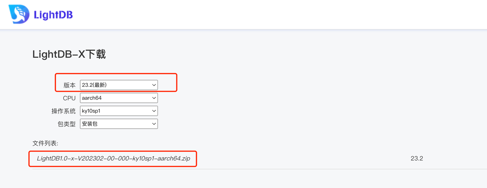

# LightDB（22.1 & 22.2版本） FAQ
## 1、如何选择LightDB安装包
下载地址：www.hs.net/lightdb ，注册账号登录后选择对应的下载版本 

如何确定操作系统版本，我们以麒麟系统为例，如下
```
# nkvers
############## Kylin Linux Version #################
Release:
Kylin Linux Advanced Server release V10 (Tercel)

Kernel:
4.19.90-23.8.v2101.ky10.x86_64

Build:
Kylin Linux Advanced Server
release V10 (SP1) /(Tercel)-x86_64-Build20/20210518
#################################################

# lscpu
架构：                           x86_64
CPU 运行模式：                   32-bit, 64-bit
...
```
可以看出操作系统为麒麟V10，cpu架构为x86_64，则选择 lightdb-x-13.3-22.2-5950-kylinV10.x86_64.zip 进行下载安装 ，其中lightdb-x开始的包为数据库；
lightdb-em开始的为LightDB PaaS原生服务平台。

## 2、LightDB如何进行逻辑备份、恢复
### 备份命令
```
PGPASSWORD=hundsun lt_dump -Usubacc1 -h10.19.36.28 -p5432 -d subacc1 -n subacc1 -F d --if-exists -c -f subacc1 -v
```
说明：PGPASSWORD=密码 lt_dump  -U用户名 -h IP  -p 端口 -d 库名  -n schema名字 -F 文件格式 --if-exists -c 如果存在就删除重新创建 -f 文件名 -v详情
### 恢复命令
```
PGPASSWORD=hundsun lt_restore subacc1 -U lightdb -h 10.19.36.28 -p 5432 -n subacc1 -d subacc1 --if-exists -c -v
```
说明：PGPASSWORD=密码 lt_restore 文件名 -U用户名 -h IP  -p 端口 -n schema名字 -d 库名  --if-exists -c 如果存在就删除重新创建 -f 文件名 -v详情）

### 并行的进行备份和恢复
```
PGPASSWORD=hundsun lt_dump -Fd -Ulightdb -h 10.19.36.28 -p 5432 -d fund60 -j8 -f fund60 -c --if-exists -v 

PGPASSWORD=hundsun lt_restore fund60 -U lightdb -h 10.19.36.28 -p 5432 -n fund60acco1 -n fund60pub -j8 -d fund60 --section=pre-data --section=data --if-exists -c -v
PGPASSWORD=hundsun lt_restore fund60 -U lightdb -h 10.19.36.28 -p 5432 -n fund60acco1 -n fund60pub -d fund60 --section=post-data --if-exists -c -v
```
## 3、如何进行LightDB客户端部署
### 1、安装包上传到客户端服务器
解压并且给予相应的权限，应用服务器系统用户我们以ta6为例
```
[ta6@client ~]$ cd /home/ta6/lightdb_client/lightdb-x-13.3-22.2-5950-kylinV10sp1.x86_64/lightdb-x/13.3-22.2/bin/
[ta6@client bin]$ pwd
/home/ta6/lightdb_client/lightdb-x-13.3-22.2-5950-kylinV10sp1.x86_64/lightdb-x/13.3-22.2/bin
```
### 2、配置环境变量
```
[ta6@client bin]$ cat ~/.bashrc 
# .bashrc
# Source global definitions
if [ -f /etc/bashrc ]; then
        . /etc/bashrc
fi
# Uncomment the following line if you don't like systemctl's auto-paging feature:
# export SYSTEMD_PAGER=
# User specific aliases and functions
export LIGHTDB_PORT=
export PGUSER=
export LIGHTDB_HOST=
export PGHOME=/home/ta6/lightdb_client/lightdb-x-13.3-22.2-5950-kylinV10sp1.x86_64/lightdb-x/13.3-22.2
export PGDATA=
export PATH=${PGHOME}/bin:${PGHOME}/tools/iftop/bin:${PGHOME}/tools/iotop/bin:${PGHOME}/tools/linux-ftools/bin:${PGHOME}/tools/vmtouch/bin:${PATH}
export LD_LIBRARY_PATH=${PGHOME}/lib:${PGHOME}/lib/ltext:${LD_LIBRARY_PATH}
export LTPORT=
export LTUSER=
export LTHOST=
export LTHOME=/home/ta6/lightdb_client/lightdb-x-13.3-22.2-5950-kylinV10sp1.x86_64/lightdb-x/13.3-22.2
export LTDATA=
export PATH=${LTHOME}/bin:${LTHOME}/tools/bin:${LTHOME}/tools/sbin:${PATH}
export LD_LIBRARY_PATH=${LTHOME}/lib:${LTHOME}/lib/ltext:${LTHOME}/tools/lib64:${LD_LIBRARY_PATH}
```
### 3、执行. ~/.bashrc 使环境变量生效
### 4、验证
如果执行ltsql、lt_dump等命令成功返回结果，说明客户端部署正常，如果执行命令时显示缺少系统依赖包等问题，举例如下

```
$ ltsql
ltsql: error while loading shared libraries: libreadline.so.8: canot open shared object file
```
上述错误说明系统缺少readline包，可以yum进行安装，如果配置yum环境受限，可以进入安装包的system-lib下使用rpm进行安装
```
# cd lightdb-x-13.3-22.2-5950-kylinV10sp1.x86_64/system-lib
# rpm -ivh readline-8.0.3.ky10.x86_64.rpm
```
## 4、LightDB 更改列属性语法
习惯于Oracle语法的同学，习惯用下面SQL执行更改列名和默认值等
```
SQL> desc emp;
 Name                                      Null?    Type
 ----------------------------------------- -------- ----------------------------
 EMPNO                                     NOT NULL NUMBER(4)
 ENAME                                              VARCHAR2(10)
 JOB                                                VARCHAR2(9)
 MGR                                                NUMBER(4)
 HIREDATE                                           DATE
 SAL                                                NUMBER(7,2)
 COMM                                               NUMBER(7,2)
 DEPTNO                                             NUMBER(2)
 DNAME                                              VARCHAR2(100)
SQL> 
SQL> alter table emp modify ename varchar2(20) default ' ';
Table altered.
```
LightDB用法
```
lightdb@postgres=# alter table emp alter column ename type varchar2(20);
ALTER TABLE
lightdb@postgres=# alter table emp alter column ename set default ' ';
ALTER TABLE
lightdb@postgres=# \d emp
                       Table "public.emp"
  Column  |     Type      | Collation | Nullable |    Default    
----------+---------------+-----------+----------+---------------
 empno    | numeric(4,0)  |           | not null | 
 ename    | varchar2(20)  |           |          | ' '::varchar2
 job      | varchar2(9)   |           |          | 
 mgr      | numeric(4,0)  |           |          | 
 hiredate | date          |           |          | 
 sal      | numeric(7,2)  |           |          | 
 comm     | numeric(7,2)  |           |          | 
 deptno   | numeric(2,0)  |           |          | 
 dname    | varchar2(100) |           |          | 
Indexes:
    "pk_emp" PRIMARY KEY, btree (empno)

\h alter table 
```
## 5、LightDB的递归语法
我们知道Oracle的递归语句为start with connect by语法。 

Oracle：
```
SELECT
	DISTINCT ID,
	PARENT_MODULE_CODE,
	MODULE_CODE,
	MODULE_NAME,
	LEAF_MARK,
	NODE_EXPAND,
	RAR_NAME_FORMAT,
	RAR_SUFFIX_FORMAT,
	REPORT_FILE_NAME_FORMAT,
	REPORT_FILE_SUFFIX_FORMAT,
	EXPORT_FILE_PATH,
	REPORT_SEND_TYPE,
	FILING_TYPE,
	FEED_BACK_DOC_PATH,
	FEED_BACK_DOC_NAME_FORMAT,
	FEED_BACK_DOC_SUFFIX_FORMAT,
	BUSINESS_REPORT_SQL,
	CREATE_TIME,
	UPDATE_TIME,
	CREATOR_NO,
	UPDATOR_NO,
	STATUS,
	REPORT_FILE_CODE,
	REPORT_RAR_CODE,
	GEN_REPORT_DATA_TYPE,
	GEN_REPORT_DATA_EXP,
	GEN_BDATA_DATASOURCE_ID,
	ENV_ID
FROM URP_REPORT_MODULE t
WHERE env_id = '001'
START WITH status = 1
CONNECT BY PRIOR t.parent_module_code = t.module_code
ORDER BY t.module_code ASC, t.module_name ASC;
```
LightDB 需要使用with recursive 进行改写
```
with recursive cte as (
select
	ID,
	PARENT_MODULE_CODE,
	MODULE_CODE,
	MODULE_NAME,
	LEAF_MARK,
	NODE_EXPAND,
	RAR_NAME_FORMAT,
	RAR_SUFFIX_FORMAT,
	REPORT_FILE_NAME_FORMAT,
	REPORT_FILE_SUFFIX_FORMAT,
	EXPORT_FILE_PATH,
	REPORT_SEND_TYPE,
	FILING_TYPE,
	FEED_BACK_DOC_PATH,
	FEED_BACK_DOC_NAME_FORMAT,
	FEED_BACK_DOC_SUFFIX_FORMAT,
	BUSINESS_REPORT_SQL,
	CREATE_TIME,
	UPDATE_TIME,
	CREATOR_NO,
	UPDATOR_NO,
	STATUS,
	REPORT_FILE_CODE,
	REPORT_RAR_CODE,
	GEN_REPORT_DATA_TYPE,
	GEN_REPORT_DATA_EXP,
	GEN_BDATA_DATASOURCE_ID,
	ENV_ID
from
	URP_REPORT_MODULE
where
	status = 1
union all
select
	d.ID,
	d.PARENT_MODULE_CODE,
	d.MODULE_CODE,
	d.MODULE_NAME,
	d.LEAF_MARK,
	d.NODE_EXPAND,
	d.RAR_NAME_FORMAT,
	d.RAR_SUFFIX_FORMAT,
	d.REPORT_FILE_NAME_FORMAT,
	d.REPORT_FILE_SUFFIX_FORMAT,
	d.EXPORT_FILE_PATH,
	d.REPORT_SEND_TYPE,
	d.FILING_TYPE,
	d.FEED_BACK_DOC_PATH,
	d.FEED_BACK_DOC_NAME_FORMAT,
	d.FEED_BACK_DOC_SUFFIX_FORMAT,
	d.BUSINESS_REPORT_SQL,
	d.CREATE_TIME,
	d.UPDATE_TIME,
	d.CREATOR_NO,
	d.UPDATOR_NO,
	d.STATUS,
	d.REPORT_FILE_CODE,
	d.REPORT_RAR_CODE,
	d.GEN_REPORT_DATA_TYPE,
	d.GEN_REPORT_DATA_EXP,
	d.GEN_BDATA_DATASOURCE_ID,
	d.ENV_ID
from
	URP_REPORT_MODULE d
join cte on
	cte.parent_module_code = d.module_code )
select
	distinct ID,
	PARENT_MODULE_CODE,
	MODULE_CODE,
	MODULE_NAME,
	LEAF_MARK,
	NODE_EXPAND,
	RAR_NAME_FORMAT,
	RAR_SUFFIX_FORMAT,
	REPORT_FILE_NAME_FORMAT,
	REPORT_FILE_SUFFIX_FORMAT,
	EXPORT_FILE_PATH,
	REPORT_SEND_TYPE,
	FILING_TYPE,
	FEED_BACK_DOC_PATH,
	FEED_BACK_DOC_NAME_FORMAT,
	FEED_BACK_DOC_SUFFIX_FORMAT,
	BUSINESS_REPORT_SQL,
	CREATE_TIME,
	UPDATE_TIME,
	CREATOR_NO,
	UPDATOR_NO,
	STATUS,
	REPORT_FILE_CODE,
	REPORT_RAR_CODE,
	GEN_REPORT_DATA_TYPE,
	GEN_REPORT_DATA_EXP,
	GEN_BDATA_DATASOURCE_ID,
	ENV_ID
from
	cte
order by
	cte.module_code asc,
	cte.module_name asc;
```
## 6、如何确定LightDB当前连接是否已满 
查询SQL语句如下：
```
SELECT NAME, setting::number as cnt FROM pg_settings WHERE NAME = 'max_connections'
union all
select state ,count(*)  as cnt from pg_stat_activity group by state;
      name       | cnt  
-----------------+------
 max_connections | 2000
                 |    5
 active          |    2
 idle            |  709
(4 rows)
```
说明：max_connections表示当前数据库最大连接数为2000
## 7、LightDB程序客户端
类比于Oracle的客户端PL/SQL developer，LightDB推荐使用 dbeaver，下载地址：  https://dbeaver.io/ 
下载成功安装后，点击左上角加号进行登录，找到大象图标进行登录

填写数据库IP、端口、用户名、密码等信息，测试连接登录即可

## 8、LightDB访问Oracle
### 1、安装插件
LightDB默认集成了oracle_fdw插件
```language
create extension oracle_fdw;
```
### 2、安装Oracle客户端
oracle轻量客户端可直接从oracle官网https://www.oracle.com/database/technologies/instant-client/downloads.html下载。

```language
instantclient-basic-linux.x64-21.6.0.0.0dbru.zip
instantclient-sdk-linux.x64-21.6.0.0.0dbru.zip
instantclient-sqlplus-linux.x64-21.6.0.0.0dbru.zip
```
解压到当前目录
```
[lightdb@node1 ~]$ pwd
/home/lightdb
[lightdb@node1 ~]$ unzip instantclient-basic-linux.x64-21.6.0.0.0dbru.zip
[lightdb@node1 ~]$ unzip instantclient-sdk-linux.x64-21.6.0.0.0dbru.zip
[lightdb@node1 ~]$ unzip instantclient-sqlplus-linux.x64-21.6.0.0.0dbru.zip
[lightdb@node1 ~]$ ls -ltr | grep 21.6
-rw-r--r--  1 lightdb lightdb  78665919 Jul  1 11:10 instantclient-basic-linux.x64-21.6.0.0.0dbru.zip
-rw-r--r--  1 lightdb lightdb   1001535 Jul  1 11:48 instantclient-sdk-linux.x64-21.6.0.0.0dbru.zip
-rw-r--r--  1 lightdb lightdb    936841 Jul  1 13:12 instantclient-sqlplus-linux.x64-21.6.0.0.0dbru.zip
drwxrwxr-x  4 lightdb lightdb      4096 Jul  1 13:16 instantclient_21_6
```
配置环境变量
```
cat ~/.bash_profile
export PATH
export EDITOR=vi 
export NLS_LANG=AMERICAN_AMERICA.AL32UTF8
export ORACLE_BASE=/home/lightdb/instantclient_21_6
export ORACLE_HOME=/home/lightdb/instantclient_21_6
export ORACLE_SID=
export PATH=$ORACLE_HOME:$ORACLE_HOME/OPatch:$GGATE:$PATH
export LD_LIBRARY_PATH=$ORACLE_HOME:/usr/lib:$GGATE:$LD_LIBRARY_PATH
export TNS_ADMIN=$ORACLE_HOME/network/admin
```
### 创建foreign 表
```language
create server oradb foreign data wrapper oracle_fdw options (dbserver '//10.0.4.4:1521/orcl1');
--对应删除命令
postgres=# DROP SERVER IF EXISTS oradb CASCADE;
NOTICE:  drop cascades to foreign table haha
DROP SERVER

create user mapping for USER server oradb options (user 'HR', password 'HR');
-- 对应的删除命令
postgres=# drop user mapping if exists for USER SERVER oradb;
DROP USER MAPPING
GRANT USAGE ON FOREIGN DATA WRAPPER oracle_fdw TO CURRENT_USER;
GRANT USAGE ON FOREIGN SERVER oradb TO CURRENT_USER;
create foreign table haha ( id int)
SERVER oradb OPTIONS (schema 'hr', table 'haha');
-- 创建对应结构的表，在PostgreSQL端要指明表结构，对应字段为PostgreSQL的字段类型
drop foreign table JOBS;
create foreign table JOBS 
(JOB_ID VARCHAR(10) NOT NULL,
 JOB_TITLE  VARCHAR(35) NOT NULL,
 MIN_SALARY NUMBER(6),
 MAX_SALARY NUMBER(6)) SERVER oradb OPTIONS (schema 'HR', table 'JOBS');


postgres=# select * from haha;
ERROR:  Oracle table "hr"."haha" for foreign table "haha" does not exist or does not allow read access
DETAIL:  ORA-00942: table or view does not exist
HINT:  Oracle table names are case sensitive (normally all uppercase).
```
如上错误是因为Oracle表默认存储底层为大写，在PostgreSQL端如果查询小写表名，遍报不存在错误，按照如下重建即可，表明haha要指定为大写 HAHA
```language
postgres=# drop foreign table haha;
DROP FOREIGN TABLE
postgres=# create foreign table haha 
postgres-#    ( id int)
postgres-# SERVER oradb OPTIONS (schema 'HR', table 'HAHA');
CREATE FOREIGN TABLE
postgres=# select * from haha;
 id 
----
  1
(1 row)
postgres=# \d
                             List of relations
 Schema |                  Name                  |     Type      |  Owner  
--------+----------------------------------------+---------------+---------
 public | baselines                              | table         | lightdb
 public | baselines_bl_id_seq                    | sequence      | lightdb
 public | bl_samples                             | table         | lightdb
 public | dual                                   | view          | lightdb
 public | funcs_list                             | table         | lightdb
 public | haha                                   | foreign table | lightdb
```
可以看到haha表类型为foreign table，指向了oradb的hr用户下的haha表
```language
postgres-# \d haha
                   Foreign table "public.haha"
 Column |  Type   | Collation | Nullable | Default | FDW options 
--------+---------+-----------+----------+---------+-------------
 id     | integer |           |          |         | 
Server: oradb
FDW options: (schema 'HR', "table" 'HAHA')
```
查看fdw server
```language
postgres=# select * from pg_foreign_server;
  oid   | srvname | srvowner | srvfdw | srvtype | srvversion |       srvacl        |            srvoptions            
--------+---------+----------+--------+---------+------------+---------------------+----------------------------------
 485122 | oradb   |       10 | 485121 |         |            | {lightdb=U/lightdb} | {dbserver=//10.0.4.4:1521/orcl1}
(1 row)
```
外部表和用户映射关系
```language
postgres=# select * from pg_foreign_table;
 ftrelid | ftserver |       ftoptions        
---------+----------+------------------------
  485414 |   485122 | {schema=HR,table=HAHA}
(1 row)

postgres=# select * from pg_user_mapping;
  oid   | umuser | umserver |       umoptions       
--------+--------+----------+-----------------------
 485123 |     10 |   485122 | {user=hr,password=hr}
(1 row)

postgres=# select * from pg_foreign_data_wrapper;
  oid   |     fdwname     | fdwowner | fdwhandler | fdwvalidator |       fdwacl        | fdwoptions 
--------+-----------------+----------+------------+--------------+---------------------+------------
  15199 | dblink_fdw      |       10 |          0 |        15198 |                     | 
  17299 | timescaledb_fdw |       10 |      17297 |        17298 |                     | 
 485121 | oracle_fdw      |       10 |     485116 |       485117 | {lightdb=U/lightdb} | 
(3 rows)
```

