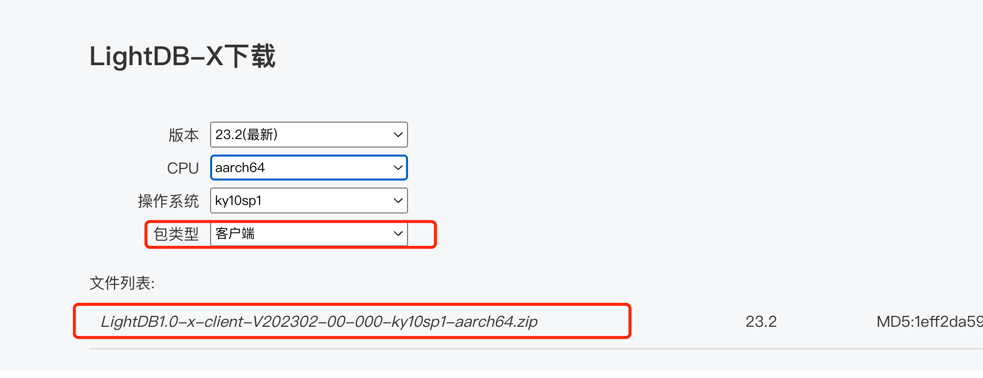

# LightDB（22.1 & 22.2 & 22.3版本） FAQ

- [1、如何选择LightDB安装包](https://github.com/hslightdb/LightDB-FAQ#1%E5%A6%82%E4%BD%95%E9%80%89%E6%8B%A9lightdb%E5%AE%89%E8%A3%85%E5%8C%85)  
- [2、LightDB如何进行逻辑备份、恢复](https://github.com/hslightdb/LightDB-FAQ#2lightdb%E5%A6%82%E4%BD%95%E8%BF%9B%E8%A1%8C%E9%80%BB%E8%BE%91%E5%A4%87%E4%BB%BD%E6%81%A2%E5%A4%8D)  
- [3、如何进行LightDB客户端部署，LightDB是否有windows版客户端?](https://github.com/hslightdb/LightDB-FAQ#3%E5%A6%82%E4%BD%95%E8%BF%9B%E8%A1%8Clightdb%E5%AE%A2%E6%88%B7%E7%AB%AF%E9%83%A8%E7%BD%B2lightdb%E6%98%AF%E5%90%A6%E6%9C%89windows%E7%89%88%E5%AE%A2%E6%88%B7%E7%AB%AF)    
- [4、LightDB更改列属性语法](https://github.com/hslightdb/LightDB-FAQ#4lightdb%E6%9B%B4%E6%94%B9%E5%88%97%E5%B1%9E%E6%80%A7%E8%AF%AD%E6%B3%95)  
- [5、LightDB的递归语法](https://github.com/hslightdb/LightDB-FAQ#5lightdb%E7%9A%84%E9%80%92%E5%BD%92%E8%AF%AD%E6%B3%95)  
- [6、如何确定LightDB当前连接是否已满，满了怎么分析?](https://github.com/hslightdb/LightDB-FAQ#6%E5%A6%82%E4%BD%95%E7%A1%AE%E5%AE%9Alightdb%E5%BD%93%E5%89%8D%E8%BF%9E%E6%8E%A5%E6%98%AF%E5%90%A6%E5%B7%B2%E6%BB%A1)  
- [7、如何配置LightDB集成开发环境](https://github.com/hslightdb/LightDB-FAQ#7%E5%A6%82%E4%BD%95%E9%85%8D%E7%BD%AElightdb%E9%9B%86%E6%88%90%E5%BC%80%E5%8F%91%E7%8E%AF%E5%A2%83)  
- [8、如何实现LightDB访问Oracle表](https://github.com/hslightdb/LightDB-FAQ#8%E5%A6%82%E4%BD%95%E5%AE%9E%E7%8E%B0lightdb%E8%AE%BF%E9%97%AEoracle%E8%A1%A8)  
- [9、如何定位LightDB数据库中锁阻塞链情况](https://github.com/hslightdb/LightDB-FAQ#9%E5%A6%82%E4%BD%95%E5%AE%9A%E4%BD%8Dlightdb%E6%95%B0%E6%8D%AE%E5%BA%93%E4%B8%AD%E9%94%81%E9%98%BB%E5%A1%9E%E9%93%BE%E6%83%85%E5%86%B5)  
- [10、如果用户无法在自己的数据库中创建和删除schema怎么办](https://github.com/hslightdb/LightDB-FAQ#10%E5%A6%82%E6%9E%9C%E7%94%A8%E6%88%B7%E6%97%A0%E6%B3%95%E5%9C%A8%E8%87%AA%E5%B7%B1%E7%9A%84%E6%95%B0%E6%8D%AE%E5%BA%93%E4%B8%AD%E5%88%9B%E5%BB%BA%E5%92%8C%E5%88%A0%E9%99%A4schema%E6%80%8E%E4%B9%88%E5%8A%9E)  
- [11、LightDB标准的创建用户语句是怎样的](https://github.com/hslightdb/LightDB-FAQ#11lightdb%E6%A0%87%E5%87%86%E7%9A%84%E5%88%9B%E5%BB%BA%E7%94%A8%E6%88%B7%E8%AF%AD%E5%8F%A5%E6%98%AF%E6%80%8E%E6%A0%B7%E7%9A%84)  
- [12、如何下载LightDB JDBC驱动](https://github.com/hslightdb/LightDB-FAQ#12%E5%A6%82%E4%BD%95%E4%B8%8B%E8%BD%BDlightdb-jdbc%E9%A9%B1%E5%8A%A8)
- [13、选择图形化安装LightDB 无法启动安装界面怎么办](https://github.com/hslightdb/LightDB-FAQ#13%E9%80%89%E6%8B%A9%E5%9B%BE%E5%BD%A2%E5%8C%96%E5%AE%89%E8%A3%85lightdb-%E6%97%A0%E6%B3%95%E5%90%AF%E5%8A%A8%E5%AE%89%E8%A3%85%E7%95%8C%E9%9D%A2%E6%80%8E%E4%B9%88%E5%8A%9E)
- [14、查看LightDB安装目录、实例目录、归档目录](https://github.com/hslightdb/LightDB-FAQ#14%E6%9F%A5%E7%9C%8Blightdb%E5%AE%89%E8%A3%85%E7%9B%AE%E5%BD%95%E5%AE%9E%E4%BE%8B%E7%9B%AE%E5%BD%95%E5%BD%92%E6%A1%A3%E7%9B%AE%E5%BD%95)
- [15、LightDB包含哪些日志?](https://github.com/hslightdb/LightDB-FAQ#15lightdb%E5%8C%85%E5%90%AB%E5%93%AA%E4%BA%9B%E6%97%A5%E5%BF%97)
- [16、查看数据库日志中的错误信息](https://github.com/hslightdb/LightDB-FAQ#16%E6%9F%A5%E7%9C%8B%E6%95%B0%E6%8D%AE%E5%BA%93%E6%97%A5%E5%BF%97%E4%B8%AD%E7%9A%84%E9%94%99%E8%AF%AF%E4%BF%A1%E6%81%AF)
- [17、查看是否开启了慢日志，开启与关闭慢日志](https://github.com/hslightdb/LightDB-FAQ#17%E6%9F%A5%E7%9C%8B%E6%98%AF%E5%90%A6%E5%BC%80%E5%90%AF%E4%BA%86%E6%85%A2%E6%97%A5%E5%BF%97%E5%BC%80%E5%90%AF%E4%B8%8E%E5%85%B3%E9%97%AD%E6%85%A2%E6%97%A5%E5%BF%97)
- [18、如何通过lt_probackup对数据库进行物理备份和恢复](https://github.com/hslightdb/LightDB-FAQ#18%E5%A6%82%E4%BD%95%E9%80%9A%E8%BF%87lt_probackup%E5%AF%B9%E6%95%B0%E6%8D%AE%E5%BA%93%E8%BF%9B%E8%A1%8C%E7%89%A9%E7%90%86%E5%A4%87%E4%BB%BD%E5%92%8C%E6%81%A2%E5%A4%8D)
- [19、查看安装了哪些extension](https://github.com/hslightdb/LightDB-FAQ#19%E6%9F%A5%E7%9C%8B%E5%AE%89%E8%A3%85%E4%BA%86%E5%93%AA%E4%BA%9Bextension)
- [20、查看按大小排序的前20张表](https://github.com/hslightdb/LightDB-FAQ#20%E6%9F%A5%E7%9C%8B%E6%8C%89%E5%A4%A7%E5%B0%8F%E6%8E%92%E5%BA%8F%E7%9A%84%E5%89%8D20%E5%BC%A0%E8%A1%A8)
- [21、查看LightDB当前的整体负载](https://github.com/hslightdb/LightDB-FAQ#21%E6%9F%A5%E7%9C%8Blightdb%E5%BD%93%E5%89%8D%E7%9A%84%E6%95%B4%E4%BD%93%E8%B4%9F%E8%BD%BD)
- [22、查看LightDB的生效配置，修改会话配置、全局配置](https://github.com/hslightdb/LightDB-FAQ#22%E6%9F%A5%E7%9C%8Blightdb%E7%9A%84%E7%94%9F%E6%95%88%E9%85%8D%E7%BD%AE%E4%BF%AE%E6%94%B9%E4%BC%9A%E8%AF%9D%E9%85%8D%E7%BD%AE%E5%85%A8%E5%B1%80%E9%85%8D%E7%BD%AE)
- [23、什么是vacuum？为什么要执行vacuum？怎么确定vacuum是否成功？](https://github.com/hslightdb/LightDB-FAQ#23%E4%BB%80%E4%B9%88%E6%98%AFvacuum%E4%B8%BA%E4%BB%80%E4%B9%88%E8%A6%81%E6%89%A7%E8%A1%8Cvacuum%E6%80%8E%E4%B9%88%E7%A1%AE%E5%AE%9Avacuum%E6%98%AF%E5%90%A6%E6%88%90%E5%8A%9F)
- [24、查看最近的检查点执行时间](https://github.com/hslightdb/LightDB-FAQ#24%E6%9F%A5%E7%9C%8B%E6%9C%80%E8%BF%91%E7%9A%84%E6%A3%80%E6%9F%A5%E7%82%B9%E6%89%A7%E8%A1%8C%E6%97%B6%E9%97%B4)
- [25、怎么查看checkpoint执行频率？怎么查看auto vacuum频率？](https://github.com/hslightdb/LightDB-FAQ#25%E6%80%8E%E4%B9%88%E6%9F%A5%E7%9C%8Bcheckpoint%E6%89%A7%E8%A1%8C%E9%A2%91%E7%8E%87%E6%80%8E%E4%B9%88%E6%9F%A5%E7%9C%8Bauto-vacuum%E9%A2%91%E7%8E%87)
- [26、lt_wal目录过大，怎么确定是否可以删除？如何删除?](https://github.com/hslightdb/LightDB-FAQ#26lt_wal%E7%9B%AE%E5%BD%95%E8%BF%87%E5%A4%A7%E6%80%8E%E4%B9%88%E7%A1%AE%E5%AE%9A%E6%98%AF%E5%90%A6%E5%8F%AF%E4%BB%A5%E5%88%A0%E9%99%A4%E5%A6%82%E4%BD%95%E5%88%A0%E9%99%A4)
- [27、查看LightDB启动时间](https://github.com/hslightdb/LightDB-FAQ#27%E6%9F%A5%E7%9C%8Blightdb%E5%90%AF%E5%8A%A8%E6%97%B6%E9%97%B4)
- [28、查看当前事务号](https://github.com/hslightdb/LightDB-FAQ#28%E6%9F%A5%E7%9C%8B%E5%BD%93%E5%89%8D%E4%BA%8B%E5%8A%A1%E5%8F%B7)
- [29、看LightDB实例概要信息](https://github.com/hslightdb/LightDB-FAQ#29%E7%9C%8Blightdb%E5%AE%9E%E4%BE%8B%E6%A6%82%E8%A6%81%E4%BF%A1%E6%81%AF)
- [30、复制管理功能](https://github.com/hslightdb/LightDB-FAQ#30%E5%A4%8D%E5%88%B6%E7%AE%A1%E7%90%86%E5%8A%9F%E8%83%BD)
- [31、其他管理功能函数](https://github.com/hslightdb/LightDB-FAQ#31%E5%85%B6%E4%BB%96%E7%AE%A1%E7%90%86%E5%8A%9F%E8%83%BD%E5%87%BD%E6%95%B0)
- [32、高可用归档清理](https://github.com/hslightdb/LightDB-FAQ#32%E9%AB%98%E5%8F%AF%E7%94%A8%E5%BD%92%E6%A1%A3%E6%B8%85%E7%90%86)
- [33、日志清理](https://github.com/hslightdb/LightDB-FAQ#33%E6%97%A5%E5%BF%97%E6%B8%85%E7%90%86)
- [34、WAL文件缺失或被误删](https://github.com/hslightdb/LightDB-FAQ#34wal%E6%96%87%E4%BB%B6%E7%BC%BA%E5%A4%B1%E6%88%96%E8%A2%AB%E8%AF%AF%E5%88%A0)
- [35、查看LightDB是否高可用、集群信息、主从节点](https://github.com/hslightdb/LightDB-FAQ#35%E6%9F%A5%E7%9C%8Blightdb%E6%98%AF%E5%90%A6%E9%AB%98%E5%8F%AF%E7%94%A8%E9%9B%86%E7%BE%A4%E4%BF%A1%E6%81%AF%E4%B8%BB%E4%BB%8E%E8%8A%82%E7%82%B9)
- [36、判断集群健康状态](https://github.com/hslightdb/LightDB-FAQ#36%E5%88%A4%E6%96%AD%E9%9B%86%E7%BE%A4%E5%81%A5%E5%BA%B7%E7%8A%B6%E6%80%81)
- [37、查看集群事件](https://github.com/hslightdb/LightDB-FAQ#37%E6%9F%A5%E7%9C%8B%E9%9B%86%E7%BE%A4%E4%BA%8B%E4%BB%B6)
- [38、查看主从同步模式与延时](https://github.com/hslightdb/LightDB-FAQ#38%E6%9F%A5%E7%9C%8B%E4%B8%BB%E4%BB%8E%E5%90%8C%E6%AD%A5%E6%A8%A1%E5%BC%8F%E4%B8%8E%E5%BB%B6%E6%97%B6)
- [39、集群复制级别](https://github.com/hslightdb/LightDB-FAQ#39%E9%9B%86%E7%BE%A4%E5%A4%8D%E5%88%B6%E7%BA%A7%E5%88%AB)
- [40、主备切换](https://github.com/hslightdb/LightDB-FAQ#40%E4%B8%BB%E5%A4%87%E5%88%87%E6%8D%A2)
- [41、故障恢复，主节点重新加入作为从节点](https://github.com/hslightdb/LightDB-FAQ#41%E6%95%85%E9%9A%9C%E6%81%A2%E5%A4%8D%E4%B8%BB%E8%8A%82%E7%82%B9%E9%87%8D%E6%96%B0%E5%8A%A0%E5%85%A5%E4%BD%9C%E4%B8%BA%E4%BB%8E%E8%8A%82%E7%82%B9)
- [42、什么时候会rejoin失败、如何确定肯定无法rejoin了？无法rejoin的节点如何重新加入？](https://github.com/hslightdb/LightDB-FAQ#42%E4%BB%80%E4%B9%88%E6%97%B6%E5%80%99%E4%BC%9Arejoin%E5%A4%B1%E8%B4%A5%E5%A6%82%E4%BD%95%E7%A1%AE%E5%AE%9A%E8%82%AF%E5%AE%9A%E6%97%A0%E6%B3%95rejoin%E4%BA%86%E6%97%A0%E6%B3%95rejoin%E7%9A%84%E8%8A%82%E7%82%B9%E5%A6%82%E4%BD%95%E9%87%8D%E6%96%B0%E5%8A%A0%E5%85%A5)
- [43、什么是timeline，timeline什么时候变化？如何查看当前的timeline id？](https://github.com/hslightdb/LightDB-FAQ#43%E4%BB%80%E4%B9%88%E6%98%AFtimelinetimeline%E4%BB%80%E4%B9%88%E6%97%B6%E5%80%99%E5%8F%98%E5%8C%96%E5%A6%82%E4%BD%95%E6%9F%A5%E7%9C%8B%E5%BD%93%E5%89%8D%E7%9A%84timeline-id)
- [44、当出现双主时如何处理](https://github.com/hslightdb/LightDB-FAQ#44%E5%BD%93%E5%87%BA%E7%8E%B0%E5%8F%8C%E4%B8%BB%E6%97%B6%E5%A6%82%E4%BD%95%E5%A4%84%E7%90%86)
- [45、如何查看VIP当前在哪个节点](https://github.com/hslightdb/LightDB-FAQ#45%E5%A6%82%E4%BD%95%E6%9F%A5%E7%9C%8Bvip%E5%BD%93%E5%89%8D%E5%9C%A8%E5%93%AA%E4%B8%AA%E8%8A%82%E7%82%B9)
- [46、如何触发VIP漂移](https://github.com/hslightdb/LightDB-FAQ#46%E5%A6%82%E4%BD%95%E8%A7%A6%E5%8F%91vip%E6%BC%82%E7%A7%BB)
- [47、为什么会出现VIP同时在两个节点？](https://github.com/hslightdb/LightDB-FAQ#47%E4%B8%BA%E4%BB%80%E4%B9%88%E4%BC%9A%E5%87%BA%E7%8E%B0vip%E5%90%8C%E6%97%B6%E5%9C%A8%E4%B8%A4%E4%B8%AA%E8%8A%82%E7%82%B9)
- [48、高可用环境如何重启主库？](https://github.com/hslightdb/LightDB-FAQ#48%E9%AB%98%E5%8F%AF%E7%94%A8%E7%8E%AF%E5%A2%83%E5%A6%82%E4%BD%95%E9%87%8D%E5%90%AF%E4%B8%BB%E5%BA%93)
- [49、高可用环境如何重启从库？](https://github.com/hslightdb/LightDB-FAQ#49%E9%AB%98%E5%8F%AF%E7%94%A8%E7%8E%AF%E5%A2%83%E5%A6%82%E4%BD%95%E9%87%8D%E5%90%AF%E4%BB%8E%E5%BA%93)
- [50、高可用归档清理与lt_probackup备份归档清理](https://github.com/hslightdb/LightDB-FAQ#50%E9%AB%98%E5%8F%AF%E7%94%A8%E5%BD%92%E6%A1%A3%E6%B8%85%E7%90%86%E4%B8%8Elt_probackup%E5%A4%87%E4%BB%BD%E5%BD%92%E6%A1%A3%E6%B8%85%E7%90%86)
- [51、集群启停管理脚本](https://github.com/hslightdb/LightDB-FAQ#51%E9%9B%86%E7%BE%A4%E5%90%AF%E5%81%9C%E7%AE%A1%E7%90%86%E8%84%9A%E6%9C%AC)
- [52、修改有视图依赖的表字段属性](#52修改有视图依赖的表字段属性)
- [53、create or replace view 修改视图无法增加字段](#53create-or-replace-view-修改视图无法增加字段)
- [54、LightDB适配MySQL需要注意点](#53create-or-replace-view-修改视图无法增加字段)
## 1、如何选择LightDB安装包
下载地址：www.hs.net/lightdb ，注册账号登录后选择对应的下载版本 

如何确定操作系统版本，我们以麒麟系统为例，如下
```
# nkvers
############## Kylin Linux Version #################
Release:
Kylin Linux Advanced Server release V10 (Tercel)

Kernel:
4.19.90-23.8.v2101.ky10.x86_64

Build:
Kylin Linux Advanced Server
release V10 (SP1) /(Tercel)-x86_64-Build20/20210518
#################################################

# lscpu
架构：                           x86_64
CPU 运行模式：                   32-bit, 64-bit
...
```
可以看出操作系统为麒麟V10，cpu架构为x86_64，则选择 lightdb-x-13.3-22.2-5950-kylinV10.x86_64.zip 进行下载安装 ，其中lightdb-x开始的包为数据库；
lightdb-em开始的为LightDB PaaS原生服务平台。

## 2、LightDB如何进行逻辑备份、恢复
### 备份命令
```
PGPASSWORD=hundsun lt_dump -Usubacc1 -h10.19.36.28 -p5432 -d subacc1 -n subacc1 -F d --if-exists -c -f subacc1 -v
```
说明：PGPASSWORD=密码 lt_dump  -U用户名 -h IP  -p 端口 -d 库名  -n schema名字 -F 文件格式 --if-exists -c 如果存在就删除重新创建 -f 文件名 -v详情
### 恢复命令
```
PGPASSWORD=hundsun lt_restore subacc1 -U lightdb -h 10.19.36.28 -p 5432 -n subacc1 -d subacc1 --if-exists -c -v
```
说明：PGPASSWORD=密码 lt_restore 文件名 -U用户名 -h IP  -p 端口 -n schema名字 -d 库名  --if-exists -c 如果存在就删除重新创建 -f 文件名 -v详情）

### 并行的进行备份和恢复
```
PGPASSWORD=hundsun lt_dump -Fd -Ulightdb -h 10.19.36.28 -p 5432 -d fund60 -j8 -f fund60 -c --if-exists -v 

PGPASSWORD=hundsun lt_restore fund60 -U lightdb -h 10.19.36.28 -p 5432 -n fund60acco1 -n fund60pub -j8 -d fund60 --section=pre-data --section=data --if-exists -c -v
PGPASSWORD=hundsun lt_restore fund60 -U lightdb -h 10.19.36.28 -p 5432 -n fund60acco1 -n fund60pub -d fund60 --section=post-data --if-exists -c -v
```
## 3、如何进行LightDB客户端部署，LightDB是否有windows版客户端?
### 1、安装包上传到客户端服务器
解压并且给予相应的权限，应用服务器系统用户我们以ta6为例
```
[ta6@client ~]$ cd /home/ta6/lightdb_client/lightdb-x-13.3-22.2-5950-kylinV10sp1.x86_64/lightdb-x/13.3-22.2/bin/
[ta6@client bin]$ pwd
/home/ta6/lightdb_client/lightdb-x-13.3-22.2-5950-kylinV10sp1.x86_64/lightdb-x/13.3-22.2/bin
```
### 2、配置环境变量

``` shell
[ta6@client bin]$ cat ~/.bashrc 
# .bashrc
# Source global definitions
if [ -f /etc/bashrc ]; then
        . /etc/bashrc
fi
# Uncomment the following line if you don't like systemctl's auto-paging feature:
# export SYSTEMD_PAGER=
# User specific aliases and functions

export PGHOME=/home/ta6/lightdb_client/lightdb-x-13.3-22.2-5950-kylinV10sp1.x86_64/lightdb-x/13.3-22.2
export PATH=${PGHOME}/bin:${PGHOME}/tools/iftop/bin:${PGHOME}/tools/iotop/bin:${PGHOME}/tools/linux-ftools/bin:${PGHOME}/tools/vmtouch/bin:${PATH}
export LD_LIBRARY_PATH=${PGHOME}/lib:${PGHOME}/lib/ltext:${LD_LIBRARY_PATH}
```
### 3、执行. ~/.bashrc 使环境变量生效
### 4、验证
如果执行ltsql、lt_dump等命令成功返回结果，说明客户端部署正常，如果执行命令时显示缺少系统依赖包等问题，举例如下

```
$ ltsql
ltsql: error while loading shared libraries: libreadline.so.8: canot open shared object file
```
上述错误说明系统缺少readline包，可以yum进行安装，如果配置yum环境受限，可以进入安装包的system-lib下使用rpm进行安装
```
# cd lightdb-x-13.3-22.2-5950-kylinV10sp1.x86_64/system-lib
# rpm -ivh readline-8.0.3.ky10.x86_64.rpm
```
### LightDB是否有Windows版本客户端?  
LightDB数据库中自带有Linux版客户端ltsql，如果想使用Windows版本对应的客户端，且不使用LightDB的匿名块功能时，可以使用PostgreSQL的psql客户端Windows版本，LightDB数据库的ltsql客户端针对PostgreSQL的psql客户端完全兼容，故可以直接通过PostgreSQL的psql连接操作LightDB数据库

## 4、LightDB更改列属性语法
**从LightDB 22.3开始modify column语法完全兼容Oracle**    
在LightDB22.2之前，习惯于Oracle语法的同学，习惯用下面SQL执行更改列名和默认值等
```plsql
SQL> desc emp;
 Name                                      Null?    Type
 ----------------------------------------- -------- ----------------------------
 EMPNO                                     NOT NULL NUMBER(4)
 ENAME                                              VARCHAR2(10)
 JOB                                                VARCHAR2(9)
 MGR                                                NUMBER(4)
 HIREDATE                                           DATE
 SAL                                                NUMBER(7,2)
 COMM                                               NUMBER(7,2)
 DEPTNO                                             NUMBER(2)
 DNAME                                              VARCHAR2(100)
SQL> 
SQL> alter table emp modify ename varchar2(20) default ' ';
Table altered.
```
LightDB用法
```
lightdb@postgres=# alter table emp alter column ename type varchar2(20);
ALTER TABLE
lightdb@postgres=# alter table emp alter column ename set default ' ';
ALTER TABLE
lightdb@postgres=# \d emp
                       Table "public.emp"
  Column  |     Type      | Collation | Nullable |    Default    
----------+---------------+-----------+----------+---------------
 empno    | numeric(4,0)  |           | not null | 
 ename    | varchar2(20)  |           |          | ' '::varchar2
 job      | varchar2(9)   |           |          | 
 mgr      | numeric(4,0)  |           |          | 
 hiredate | date          |           |          | 
 sal      | numeric(7,2)  |           |          | 
 comm     | numeric(7,2)  |           |          | 
 deptno   | numeric(2,0)  |           |          | 
 dname    | varchar2(100) |           |          | 
Indexes:
    "pk_emp" PRIMARY KEY, btree (empno)

\h alter table 
```
## 5、LightDB的递归语法
我们知道Oracle的递归语句为start with connect by语法。 

Oracle：
```
SELECT
	DISTINCT ID,
	PARENT_MODULE_CODE,
	MODULE_CODE,
	MODULE_NAME,
	LEAF_MARK,
	NODE_EXPAND,
	RAR_NAME_FORMAT,
	RAR_SUFFIX_FORMAT,
	REPORT_FILE_NAME_FORMAT,
	REPORT_FILE_SUFFIX_FORMAT,
	EXPORT_FILE_PATH,
	REPORT_SEND_TYPE,
	FILING_TYPE,
	FEED_BACK_DOC_PATH,
	FEED_BACK_DOC_NAME_FORMAT,
	FEED_BACK_DOC_SUFFIX_FORMAT,
	BUSINESS_REPORT_SQL,
	CREATE_TIME,
	UPDATE_TIME,
	CREATOR_NO,
	UPDATOR_NO,
	STATUS,
	REPORT_FILE_CODE,
	REPORT_RAR_CODE,
	GEN_REPORT_DATA_TYPE,
	GEN_REPORT_DATA_EXP,
	GEN_BDATA_DATASOURCE_ID,
	ENV_ID
FROM URP_REPORT_MODULE t
WHERE env_id = '001'
START WITH status = 1
CONNECT BY PRIOR t.parent_module_code = t.module_code
ORDER BY t.module_code ASC, t.module_name ASC;
```
LightDB 需要使用with recursive 进行改写
```
with recursive cte as (
select
	ID,
	PARENT_MODULE_CODE,
	MODULE_CODE,
	MODULE_NAME,
	LEAF_MARK,
	NODE_EXPAND,
	RAR_NAME_FORMAT,
	RAR_SUFFIX_FORMAT,
	REPORT_FILE_NAME_FORMAT,
	REPORT_FILE_SUFFIX_FORMAT,
	EXPORT_FILE_PATH,
	REPORT_SEND_TYPE,
	FILING_TYPE,
	FEED_BACK_DOC_PATH,
	FEED_BACK_DOC_NAME_FORMAT,
	FEED_BACK_DOC_SUFFIX_FORMAT,
	BUSINESS_REPORT_SQL,
	CREATE_TIME,
	UPDATE_TIME,
	CREATOR_NO,
	UPDATOR_NO,
	STATUS,
	REPORT_FILE_CODE,
	REPORT_RAR_CODE,
	GEN_REPORT_DATA_TYPE,
	GEN_REPORT_DATA_EXP,
	GEN_BDATA_DATASOURCE_ID,
	ENV_ID
from
	URP_REPORT_MODULE
where
	status = 1
union all
select
	d.ID,
	d.PARENT_MODULE_CODE,
	d.MODULE_CODE,
	d.MODULE_NAME,
	d.LEAF_MARK,
	d.NODE_EXPAND,
	d.RAR_NAME_FORMAT,
	d.RAR_SUFFIX_FORMAT,
	d.REPORT_FILE_NAME_FORMAT,
	d.REPORT_FILE_SUFFIX_FORMAT,
	d.EXPORT_FILE_PATH,
	d.REPORT_SEND_TYPE,
	d.FILING_TYPE,
	d.FEED_BACK_DOC_PATH,
	d.FEED_BACK_DOC_NAME_FORMAT,
	d.FEED_BACK_DOC_SUFFIX_FORMAT,
	d.BUSINESS_REPORT_SQL,
	d.CREATE_TIME,
	d.UPDATE_TIME,
	d.CREATOR_NO,
	d.UPDATOR_NO,
	d.STATUS,
	d.REPORT_FILE_CODE,
	d.REPORT_RAR_CODE,
	d.GEN_REPORT_DATA_TYPE,
	d.GEN_REPORT_DATA_EXP,
	d.GEN_BDATA_DATASOURCE_ID,
	d.ENV_ID
from
	URP_REPORT_MODULE d
join cte on
	cte.parent_module_code = d.module_code )
select
	distinct ID,
	PARENT_MODULE_CODE,
	MODULE_CODE,
	MODULE_NAME,
	LEAF_MARK,
	NODE_EXPAND,
	RAR_NAME_FORMAT,
	RAR_SUFFIX_FORMAT,
	REPORT_FILE_NAME_FORMAT,
	REPORT_FILE_SUFFIX_FORMAT,
	EXPORT_FILE_PATH,
	REPORT_SEND_TYPE,
	FILING_TYPE,
	FEED_BACK_DOC_PATH,
	FEED_BACK_DOC_NAME_FORMAT,
	FEED_BACK_DOC_SUFFIX_FORMAT,
	BUSINESS_REPORT_SQL,
	CREATE_TIME,
	UPDATE_TIME,
	CREATOR_NO,
	UPDATOR_NO,
	STATUS,
	REPORT_FILE_CODE,
	REPORT_RAR_CODE,
	GEN_REPORT_DATA_TYPE,
	GEN_REPORT_DATA_EXP,
	GEN_BDATA_DATASOURCE_ID,
	ENV_ID
from
	cte
order by
	cte.module_code asc,
	cte.module_name asc;
```
## 6、如何确定LightDB当前连接是否已满 
查询SQL语句如下：
```
SELECT NAME, setting::number as cnt FROM pg_settings WHERE NAME = 'max_connections'
union all
select state ,count(*)  as cnt from pg_stat_activity group by state;
      name       | cnt  
-----------------+------
 max_connections | 2000
                 |    5
 active          |    2
 idle            |  709
(4 rows)
```
说明：max_connections表示当前数据库最大连接数为2000  

### 如果确定连接已满，接下来怎么排查？
如果ltsql没有指定`-h host/ip`,也没有配置`LTHOST`/`PGHOST`环境变量, 那么默认会走unix domain socket, 在这种场景tcp_keepalives相关选项不起作用, 查询时显示0, 示例如下:
```
$ ltsql -p 5432
ltsql (13.8-22.3)
Type "help" for help.

test=# show tcp_keepalives%;
          name           | setting |                 description                  
-------------------------+---------+----------------------------------------------
 tcp_keepalives_count    | 0       | Maximum number of TCP keepalive retransmits.
 tcp_keepalives_idle     | 0       | Time between issuing TCP keepalives.
 tcp_keepalives_interval | 0       | Time between TCP keepalive retransmits.
(3 rows)
```
如果指定IP,则可显示lightdb.conf中配置的参数值:
```
$ ltsql -p 5432 -h 127.0.0.1
ltsql (13.8-22.3)
Type "help" for help.

test=# show tcp_keepalives%;
          name           | setting |                 description                  
-------------------------+---------+----------------------------------------------
 tcp_keepalives_count    | 5       | Maximum number of TCP keepalive retransmits.
 tcp_keepalives_idle     | 300     | Time between issuing TCP keepalives.
 tcp_keepalives_interval | 30      | Time between TCP keepalive retransmits.
(3 rows)
```


## 7、如何配置LightDB集成开发环境
Oracle一般习惯使用PL/SQL developer做为集成开发环境，同样LightDB为了使用自己的存储过程特性等特性，推荐使用dbeaver集成环境并且需要配置LightDB驱动。  
LightDB驱动下载地址：https://mvnrepository.com/artifact/io.github.hslightdb/lightdb-jdbc    
dbeaver下载地址：https://dbeaver.io/ 
下载成功安装后，找到数据库->驱动管理器->新建  

  
点击"新建"后填入如下内容，同时选择"库"选项，添加LightDB驱动  

  
上述操作完成后，点击"确定"  
  
点击"关闭"之后，点击左上角加号，选择LightDB驱动程序  


填写数据库IP、端口、用户名、密码等信息，测试连接登录即可  


## 8、如何实现LightDB访问Oracle表
### 1、安装插件
LightDB默认集成了oracle_fdw插件
```language
create extension oracle_fdw;
```
### 2、安装Oracle客户端
oracle轻量客户端可直接从oracle官网https://www.oracle.com/database/technologies/instant-client/downloads.html下载。

```language
instantclient-basic-linux.x64-21.6.0.0.0dbru.zip
instantclient-sdk-linux.x64-21.6.0.0.0dbru.zip
instantclient-sqlplus-linux.x64-21.6.0.0.0dbru.zip
```
解压到当前目录
```
[lightdb@node1 ~]$ pwd
/home/lightdb
[lightdb@node1 ~]$ unzip instantclient-basic-linux.x64-21.6.0.0.0dbru.zip
[lightdb@node1 ~]$ unzip instantclient-sdk-linux.x64-21.6.0.0.0dbru.zip
[lightdb@node1 ~]$ unzip instantclient-sqlplus-linux.x64-21.6.0.0.0dbru.zip
[lightdb@node1 ~]$ ls -ltr | grep 21.6
-rw-r--r--  1 lightdb lightdb  78665919 Jul  1 11:10 instantclient-basic-linux.x64-21.6.0.0.0dbru.zip
-rw-r--r--  1 lightdb lightdb   1001535 Jul  1 11:48 instantclient-sdk-linux.x64-21.6.0.0.0dbru.zip
-rw-r--r--  1 lightdb lightdb    936841 Jul  1 13:12 instantclient-sqlplus-linux.x64-21.6.0.0.0dbru.zip
drwxrwxr-x  4 lightdb lightdb      4096 Jul  1 13:16 instantclient_21_6
```
配置环境变量
```
cat ~/.bash_profile
export PATH
export EDITOR=vi 
export NLS_LANG=AMERICAN_AMERICA.AL32UTF8
export ORACLE_BASE=/home/lightdb/instantclient_21_6
export ORACLE_HOME=/home/lightdb/instantclient_21_6
export ORACLE_SID=
export PATH=$ORACLE_HOME:$ORACLE_HOME/OPatch:$GGATE:$PATH
export LD_LIBRARY_PATH=$ORACLE_HOME:/usr/lib:$GGATE:$LD_LIBRARY_PATH
export TNS_ADMIN=$ORACLE_HOME/network/admin
```
### 3、创建foreign 表
```language
create server oradb foreign data wrapper oracle_fdw options (dbserver '//10.0.4.4:1521/orcl1');
--对应删除命令
postgres=# DROP SERVER IF EXISTS oradb CASCADE;
NOTICE:  drop cascades to foreign table haha
DROP SERVER

create user mapping for USER server oradb options (user 'HR', password 'HR');
-- 对应的删除命令
postgres=# drop user mapping if exists for USER SERVER oradb;
DROP USER MAPPING
GRANT USAGE ON FOREIGN DATA WRAPPER oracle_fdw TO CURRENT_USER;
GRANT USAGE ON FOREIGN SERVER oradb TO CURRENT_USER;
create foreign table haha ( id int)
SERVER oradb OPTIONS (schema 'hr', table 'haha');
-- 创建对应结构的表，在PostgreSQL端要指明表结构，对应字段为PostgreSQL的字段类型
drop foreign table JOBS;
create foreign table JOBS 
(JOB_ID VARCHAR(10) NOT NULL,
 JOB_TITLE  VARCHAR(35) NOT NULL,
 MIN_SALARY NUMBER(6),
 MAX_SALARY NUMBER(6)) SERVER oradb OPTIONS (schema 'HR', table 'JOBS');


postgres=# select * from haha;
ERROR:  Oracle table "hr"."haha" for foreign table "haha" does not exist or does not allow read access
DETAIL:  ORA-00942: table or view does not exist
HINT:  Oracle table names are case sensitive (normally all uppercase).
```
如上错误是因为Oracle表默认存储底层为大写，在PostgreSQL端如果查询小写表名，遍报不存在错误，按照如下重建即可，表明haha要指定为大写 HAHA
```language
postgres=# drop foreign table haha;
DROP FOREIGN TABLE
postgres=# create foreign table haha 
postgres-#    ( id int)
postgres-# SERVER oradb OPTIONS (schema 'HR', table 'HAHA');
CREATE FOREIGN TABLE
postgres=# select * from haha;
 id 
----
  1
(1 row)
postgres=# \d
                             List of relations
 Schema |                  Name                  |     Type      |  Owner  
--------+----------------------------------------+---------------+---------
 public | baselines                              | table         | lightdb
 public | baselines_bl_id_seq                    | sequence      | lightdb
 public | bl_samples                             | table         | lightdb
 public | dual                                   | view          | lightdb
 public | funcs_list                             | table         | lightdb
 public | haha                                   | foreign table | lightdb
```
可以看到haha表类型为foreign table，指向了oradb的hr用户下的haha表
```language
postgres-# \d haha
                   Foreign table "public.haha"
 Column |  Type   | Collation | Nullable | Default | FDW options 
--------+---------+-----------+----------+---------+-------------
 id     | integer |           |          |         | 
Server: oradb
FDW options: (schema 'HR', "table" 'HAHA')
```
查看fdw server
```language
postgres=# select * from pg_foreign_server;
  oid   | srvname | srvowner | srvfdw | srvtype | srvversion |       srvacl        |            srvoptions            
--------+---------+----------+--------+---------+------------+---------------------+----------------------------------
 485122 | oradb   |       10 | 485121 |         |            | {lightdb=U/lightdb} | {dbserver=//10.0.4.4:1521/orcl1}
(1 row)
```
外部表和用户映射关系
```language
postgres=# select * from pg_foreign_table;
 ftrelid | ftserver |       ftoptions        
---------+----------+------------------------
  485414 |   485122 | {schema=HR,table=HAHA}
(1 row)

postgres=# select * from pg_user_mapping;
  oid   | umuser | umserver |       umoptions       
--------+--------+----------+-----------------------
 485123 |     10 |   485122 | {user=hr,password=hr}
(1 row)

postgres=# select * from pg_foreign_data_wrapper;
  oid   |     fdwname     | fdwowner | fdwhandler | fdwvalidator |       fdwacl        | fdwoptions 
--------+-----------------+----------+------------+--------------+---------------------+------------
  15199 | dblink_fdw      |       10 |          0 |        15198 |                     | 
  17299 | timescaledb_fdw |       10 |      17297 |        17298 |                     | 
 485121 | oracle_fdw      |       10 |     485116 |       485117 | {lightdb=U/lightdb} | 
(3 rows)
```
## 9、如何定位LightDB数据库中锁阻塞链情况
执行下面SQL即可情况锁阻塞链情况：
```SQL
WITH RECURSIVE
  lock_composite(requested, current) AS (VALUES
    ('AccessShareLock'::text, 'AccessExclusiveLock'::text),
    ('RowShareLock'::text, 'ExclusiveLock'::text),
    ('RowShareLock'::text, 'AccessExclusiveLock'::text),
    ('RowExclusiveLock'::text, 'ShareLock'::text),
    ('RowExclusiveLock'::text, 'ShareRowExclusiveLock'::text),
    ('RowExclusiveLock'::text, 'ExclusiveLock'::text),
    ('RowExclusiveLock'::text, 'AccessExclusiveLock'::text),
    ('ShareUpdateExclusiveLock'::text, 'ShareUpdateExclusiveLock'::text),
    ('ShareUpdateExclusiveLock'::text, 'ShareLock'::text),
    ('ShareUpdateExclusiveLock'::text, 'ShareRowExclusiveLock'::text),
    ('ShareUpdateExclusiveLock'::text, 'ExclusiveLock'::text),
    ('ShareUpdateExclusiveLock'::text, 'AccessExclusiveLock'::text),
    ('ShareLock'::text, 'RowExclusiveLock'::text),
    ('ShareLock'::text, 'ShareUpdateExclusiveLock'::text),
    ('ShareLock'::text, 'ShareRowExclusiveLock'::text),
    ('ShareLock'::text, 'ExclusiveLock'::text),
    ('ShareLock'::text, 'AccessExclusiveLock'::text),
    ('ShareRowExclusiveLock'::text, 'RowExclusiveLock'::text),
    ('ShareRowExclusiveLock'::text, 'ShareUpdateExclusiveLock'::text),
    ('ShareRowExclusiveLock'::text, 'ShareLock'::text),
    ('ShareRowExclusiveLock'::text, 'ShareRowExclusiveLock'::text),
    ('ShareRowExclusiveLock'::text, 'ExclusiveLock'::text),
    ('ShareRowExclusiveLock'::text, 'AccessExclusiveLock'::text),
    ('ExclusiveLock'::text, 'RowShareLock'::text),
    ('ExclusiveLock'::text, 'RowExclusiveLock'::text),
    ('ExclusiveLock'::text, 'ShareUpdateExclusiveLock'::text),
    ('ExclusiveLock'::text, 'ShareLock'::text),
    ('ExclusiveLock'::text, 'ShareRowExclusiveLock'::text),
    ('ExclusiveLock'::text, 'ExclusiveLock'::text),
    ('ExclusiveLock'::text, 'AccessExclusiveLock'::text),
    ('AccessExclusiveLock'::text, 'AccessShareLock'::text),
    ('AccessExclusiveLock'::text, 'RowShareLock'::text),
    ('AccessExclusiveLock'::text, 'RowExclusiveLock'::text),
    ('AccessExclusiveLock'::text, 'ShareUpdateExclusiveLock'::text),
    ('AccessExclusiveLock'::text, 'ShareLock'::text),
    ('AccessExclusiveLock'::text, 'ShareRowExclusiveLock'::text),
    ('AccessExclusiveLock'::text, 'ExclusiveLock'::text),
    ('AccessExclusiveLock'::text, 'AccessExclusiveLock'::text)
  )
, lock AS (
  SELECT pid,
     virtualtransaction,
     granted,
     mode,
    (locktype,
     CASE locktype
       WHEN 'relation'      THEN concat_ws(';', 'db:'||datname, 'rel:'||relation::regclass::text)
       WHEN 'extend'        THEN concat_ws(';', 'db:'||datname, 'rel:'||relation::regclass::text)
       WHEN 'page'          THEN concat_ws(';', 'db:'||datname, 'rel:'||relation::regclass::text, 'page#'||page::text)
       WHEN 'tuple'         THEN concat_ws(';', 'db:'||datname, 'rel:'||relation::regclass::text, 'page#'||page::text, 'tuple#'||tuple::text)
       WHEN 'transactionid' THEN transactionid::text
       WHEN 'virtualxid'    THEN virtualxid::text
       WHEN 'object'        THEN concat_ws(';', 'class:'||classid::regclass::text, 'objid:'||objid, 'col#'||objsubid)
       ELSE concat('db:'||datname)
     END::text) AS target
  FROM pg_catalog.pg_locks
  LEFT JOIN pg_catalog.pg_database ON (pg_database.oid = pg_locks.database)
  )
, waiting_lock AS (
  SELECT
    blocker.pid                         AS blocker_pid,
    blocked.pid                         AS pid,
    concat(blocked.mode,blocked.target) AS lock_target
  FROM lock blocker
  JOIN lock blocked
    ON ( NOT blocked.granted
     AND blocker.granted
     AND blocked.pid != blocker.pid
     AND blocked.target IS NOT DISTINCT FROM blocker.target)
  JOIN lock_composite c ON (c.requested = blocked.mode AND c.current = blocker.mode)
  )
, acquired_lock AS (
  WITH waiting AS (
    SELECT lock_target, count(lock_target) AS wait_count FROM waiting_lock GROUP BY lock_target
  )
  SELECT
    pid,
    array_agg(concat(mode,target,' + '||wait_count) ORDER BY wait_count DESC NULLS LAST) AS locks_acquired
  FROM lock
    LEFT JOIN waiting ON waiting.lock_target = concat(mode,target)
  WHERE granted
  GROUP BY pid
  )
, blocking_lock AS (
  SELECT
    ARRAY[date_part('epoch', query_start)::int, pid] AS seq,
     0::int AS "depth",
    -1::int AS blocker_pid,
    pid,
    concat('Connect: ',usename,' ',datname,' ',coalesce(host(client_addr)||':'||client_port, 'local')
      , E'\nSQL: ',replace(substr(coalesce(query,'N/A'), 1, 60), E'\n', ' ')
      , E'\nAcquired:\n  '
      , array_to_string(locks_acquired[1:5] ||
                        CASE WHEN array_upper(locks_acquired,1) > 5
                             THEN '... '||(array_upper(locks_acquired,1) - 5)::text||' more ...'
                        END,
                        E'\n  ')
    ) AS lock_info,
    concat(to_char(query_start, CASE WHEN age(query_start) > '24h' THEN 'Day DD Mon' ELSE 'HH24:MI:SS' END),E' started\n'
          ,CASE WHEN wait_event IS NOT NULL THEN 'waiting' ELSE state END,E'\n'
          ,date_trunc('second',age(now(),query_start)),' ago'
    ) AS lock_state
  FROM acquired_lock blocker
  LEFT JOIN pg_stat_activity act USING (pid)
  WHERE EXISTS
         (SELECT 'x' FROM waiting_lock blocked WHERE blocked.blocker_pid = blocker.pid)
    AND NOT EXISTS
         (SELECT 'x' FROM waiting_lock blocked WHERE blocked.pid = blocker.pid)
UNION ALL
  SELECT
    blocker.seq || blocked.pid,
    blocker.depth + 1,
    blocker.pid,
    blocked.pid,
    concat('Connect: ',usename,' ',datname,' ',coalesce(host(client_addr)||':'||client_port, 'local')
      , E'\nSQL: ',replace(substr(coalesce(query,'N/A'), 1, 60), E'\n', ' ')
      , E'\nWaiting: ',blocked.lock_target
      , CASE WHEN locks_acquired IS NOT NULL
             THEN E'\nAcquired:\n  ' ||
                  array_to_string(locks_acquired[1:5] ||
                                  CASE WHEN array_upper(locks_acquired,1) > 5
                                       THEN '... '||(array_upper(locks_acquired,1) - 5)::text||' more ...'
                                  END,
                                  E'\n  ')
        END
    ) AS lock_info,
    concat(to_char(query_start, CASE WHEN age(query_start) > '24h' THEN 'Day DD Mon' ELSE 'HH24:MI:SS' END),E' started\n'
          ,CASE WHEN wait_event IS NOT NULL THEN 'waiting' ELSE state END,E'\n'
          ,date_trunc('second',age(now(),query_start)),' ago'
    ) AS lock_state
  FROM blocking_lock blocker
  JOIN waiting_lock blocked
    ON (blocked.blocker_pid = blocker.pid)
  LEFT JOIN pg_stat_activity act ON (act.pid = blocked.pid)
  LEFT JOIN acquired_lock acq ON (acq.pid = blocked.pid)
  WHERE blocker.depth < 5
  )
SELECT concat(lpad('=> ', 4*depth, ' '),pid::text) AS "PID", lock_info AS Lock_Info, lock_state AS State
FROM blocking_lock ORDER BY seq;
```

## 10、如果用户无法在自己的数据库中创建和删除schema怎么办
### 1、第一种情况一个数据库对应一个用户和对应schema
```
lightdb@postgres=# create user hundsun password 'hundsun';
CREATE ROLE
lightdb@postgres=# create database hundsun;
CREATE DATABASE
lightdb@postgres=# \c hundsun hundsun
You are now connected to database "hundsun" as user "hundsun".
hundsun1@hundsun1=> create schema hundsun;
ERROR:  permission denied for database hundsun
```
需要给用户赋予all privileges权限
```
$ ltsql -p 5435
ltsql (13.3-22.2)
Type "help" for help.

lightdb@postgres=# alter database hundsun owner to hundsun;
ALTER DATABASE
lightdb@postgres=# \c hundsun hundsun
You are now connected to database "hundsun" as user "hundsun".
hundsun@hundsun=> create schema hundsun;
CREATE SCHEMA
```

### 2、第二种情况一个数据库对应多个用户和多个schema
我们以TA6为例子
```
create user fund60acco1 password 'fund60acco1';
create user fund60acco2 password 'fund60acco2';
create user fund60pub password 'fund60pub';
create user fund60query password 'fund60query';
create user fund60trans1 password 'fund60trans1';
create user fund60trans2 password 'fund60trans2';
create database fund60;
grant all privileges on database fund60 to fund60trans1;
grant all privileges on database fund60 to fund60trans2;
grant all privileges on database fund60 to fund60acco1;
grant all privileges on database fund60 to fund60acco2;
grant all privileges on database fund60 to fund60pub;
grant all privileges on database fund60 to fund60query;
```
举例：使用fund60query用户登录到fund60数据库下创建同名schema
```
lightdb@postgres=# \c fund60 fund60query 
Password for user fund60query: 
You are now connected to database "fund60" as user "fund60query".
fund60query@fund60=> create schema fund60query;
CREATE SCHEMA
```
## 11、LightDB标准的创建用户语句是怎样的
我们以TA6为例子
```sql
$ ltsql
ltsql (13.3-22.2)
Type "help" for help.

lightdb@postgres=# create user fund60acco1 password 'fund60acco1';
CREATE ROLE
lightdb@postgres=# create user fund60acco2 password 'fund60acco2';
CREATE ROLE
lightdb@postgres=# create user fund60pub password 'fund60pub';
CREATE ROLE
lightdb@postgres=# create user fund60query password 'fund60query';
CREATE ROLE
lightdb@postgres=# create user fund60trans1 password 'fund60trans1';
CREATE ROLE
lightdb@postgres=# create user fund60trans2 password 'fund60trans2';
CREATE ROLE
lightdb@postgres=# create database fund60;
CREATE DATABASE
lightdb@postgres=# grant all privileges on database fund60 to fund60trans1;
GRANT
lightdb@postgres=# grant all privileges on database fund60 to fund60trans2;
GRANT
lightdb@postgres=# grant all privileges on database fund60 to fund60acco1;
GRANT
lightdb@postgres=# grant all privileges on database fund60 to fund60acco2;
GRANT
lightdb@postgres=# grant all privileges on database fund60 to fund60pub;
GRANT
lightdb@postgres=# grant all privileges on database fund60 to fund60query;
GRANT
```
再分别登录到自己到库中创建和用户同名到schema，下面只举了2个例子
```
lightdb@postgres=# \c fund60 fund60query 
Password for user fund60query: 
You are now connected to database "fund60" as user "fund60query".
fund60query@fund60=> create schema fund60query;
CREATE SCHEMA
fund60query@fund60=> \c fund60 fund60pub
Password for user fund60pub: 
You are now connected to database "fund60" as user "fund60pub".
fund60pub@fund60=> create schema fund60pub;
CREATE SCHEMA
```
## 12、如何下载LightDB JDBC驱动
maven 地址，选择跟数据库对应版本进行下载
https://mvnrepository.com/artifact/io.github.hslightdb/lightdb-jdbc
```
<!-- https://mvnrepository.com/artifact/io.github.hslightdb/lightdb-jdbc -->
<dependency>
    <groupId>io.github.hslightdb</groupId>
    <artifactId>lightdb-jdbc</artifactId>
    <version>22.3.1-221201</version>
</dependency>
```
## 13、选择图形化安装LightDB 无法启动安装界面怎么办

GUI安装界面弹不出来，一般来说有两种原因：

- 首先，缺人Linux系统是否已安装GUI程序所需的依赖包
```
yum install -y libXtst
yum install -y xterm
yum install -y xorg-x11-xauth
```
- 其次，Linux系统未正确设置DISPLAY环境变量，或者Windows未正确运行Xmanager - Passive

如果无法满足上述条件，可以使用命令行安装模式，LightDB支持命令行安装模式，且与GUI安装相比仅在安装向导上有所差异，其余并无不同。

## 14、查看LightDB安装目录、实例目录、归档目录
数据库安装完成后，环境变量会写到~/.bashrc中，默认情况下数据库相关位置如下：
```shell
ls $LTHOME          # 查看安装目录
ls $LTDATA          # 查看实例目录
ls $LTHOME/archive  # 查看归档目录
```
## 15、LightDB包含哪些日志？

**数据库日志:**  
位于$LTDATA/log目录中。  
**ltcluster日志:**    
位于`$LTHOME/etc/ltcluster/`下，仅高可用版本有。  
**keepalived日志:**  
位于`/var/log/`下，并且在`$LTHOME/etc/keepalived/keepalived_lightdb.log`有keepalived检测lightdb的心跳日志，仅高可用版本需启用keepalived。  


## 16、查看数据库日志中的错误信息

LightDB日志中的错误信息包含`ERROR`或`FATAL`标签，可以此为关键词从日志文件中过滤错误行。

**单次查看当前错误日志**
```shell
cd $LTDATA/log
cat lightdb-yyyy-mm-dd_hhmmss.log | grep -E 'ERROR|FATAL'
```
**实时监控最新错误日志**
```
cd $LTDATA/log
tail -fn 10 lightdb-yyyy-mm-dd_hhmmss.log | grep -E 'ERROR|FATAL'
```

## 17、查看是否开启了慢日志，开启与关闭慢日志

在LightDB中慢日志配置参数有两处：数据库自身和auto_explain插件，使用`show`可以查看这两个参数。

```plsql
show log_min_duration_statement;    -- 数据库慢日志，默认值-1
show auto_explain.log_min_duration; -- auto_explain慢日志，默认值100ms
```

数据库慢日志仅记录SQL，auto_explain慢日志同时记录SQL和执行计划，二者参数值的含义完全相同：

- -1表示关闭慢日志
- 0表示启用慢日志，且记录所有SQL
- 大于0（如100ms、1s）表示启用慢日志，且仅记录`elapsed time`大于等于该时间的SQL

在LightDB中，`log_min_duration_statement`默认值为-1，`auto_explain.log_min_duration`默认值为100ms（前提是auto_explain已启用，默认不启用），若在`lightdb.conf`中修改了这两个参数，不用重启数据库，仅需`reload`重新加载即可生效。

```shell
lt_ctl -D $LTDATA reload
```

如果希望启用auto_explain，则需要修改`lightdb.conf`中的`shared_preload_libraries`，在其中添加auto_explain，然后重启数据库。**对于LightDB单机版，可以直接执行lt_ctl -D $LTDATA restart即可，但如果安装的是LightDB高可用或分布式，则务必按高可用和分布式的停止与启动步骤进行操作。**

## 18、如何通过lt_probackup对数据库进行物理备份和恢复


## 19、查看安装了哪些extension

- 查看所有可用的extension

```plsql
select * from pg_available_extensions;
```

- 查看当前启用的extension

```plsql
select * from pg_extension;
```
## 20、查看按大小排序的前20张表

```plsql
-- 查出按大小（table_size + index_size）排序的前20张表，并分离table_size和index_size
SELECT
	table_name,
	pg_size_pretty(table_size) AS table_size,
	pg_size_pretty(index_size) AS index_size,
	pg_size_pretty(total_size) AS total_size
FROM (
	SELECT
		table_name,
		pg_table_size(table_name) AS table_size,
		pg_indexes_size(table_name) AS index_size,
		pg_total_relation_size(table_name) AS total_size
	FROM (
		SELECT table_schema || '.' || table_name AS table_name
		FROM information_schema.tables
	) AS all_tables
	ORDER BY total_size DESC
) AS pretty_sizes
LIMIT 20;
```

## 21、查看LightDB当前的整体负载

查看LightDB当前整体负载，可以简单地使用top命令查看CPU利用率、内存使用情况、IO等指标信息，也可以使用LightDB EM来实时监控LightDB与服务器主机的各项指标。

## 22、查看LightDB的生效配置，修改会话配置、全局配置

可以用show语句查看LightDB当前的生效配置，show语句有以下几种用法：

```plsql
SHOW name;   -- 查看指定的para配置参数
SHOW ALL;    -- 查看所有配置参数
SHOW name%;  -- 查看前缀为name的配置参数
SHOW %name;  -- 查看后缀为name的配置参数
SHOW %name%; -- 查看名字中间包含name的配置参数
```

修改配置参数有两种级别：会话级和全局级。

```plsql
-- 会话级修改，并非所有参数都支持会话级修改
SET [ SESSION | LOCAL ] configuration_parameter { TO | = } { value | 'value' | DEFAULT };

-- 全局修改有两种方法：一是修改postgresql.conf，二是使用下面的SQL语句，然后按要求reload或restart生效
ALTER SYSTEM SET configuration_parameter { TO | = } { value | 'value' | DEFAULT };
```

## 23、什么是vacuum？为什么要执行vacuum？怎么确定vacuum是否成功？

vacuum用于清理数据库表中的dead tuples，因为LightDB MVCC不使用undo日志，而是将update、delete修改或删除前的记录保留在表中，并打上一个标记，对于update还会插入一条更新后的新纪录，带有这种标记的tuple叫做dead tuple，也就是死元组。

当执行过checkpoint之后，之前的死元组就没有用了，vacuum就是用来清除这些无用的死元组的，如果长时间不进行vacuum，表中的死元组就会堆积的越来越多，导致表膨胀。

vacuum语句基本用法有两种，一种是直接执行vacuum，另一种是vcuum tablename，前者对当前database中的所有表进行清理，后者仅对指定的表进行清理，执行成功时，客户端会返回一行VACUUM信息。

## 24、查看最近的检查点执行时间

```
lt_controldata $LTDATA | grep "Time of latest checkpoint:"
```

## 25、怎么查看checkpoint执行频率？怎么查看auto vacuum频率？

```
show checkpoint_timeout;  -- 查看checkpoint频率
show autovacuum_naptime;  -- 查看autovacuum频率
```

## 26、lt_wal目录过大，怎么确定是否可以删除？如何删除?

先使用`lt_controldata`获得`Latest checkpoint's REDO WAL file`，如下所示。

```
$ lt_controldata $LTDATA | grep "Latest checkpoint's REDO WAL file"
Latest checkpoint's REDO WAL file:    000000010000000000000006
```
然后通过下面的语句清理归档
```
lt_archivecleanup $LTHOME/archive `lt_controldata $LTDATA | grep "Latest checkpoint's REDO WAL file" | awk '{print $6}'`
```

`Latest checkpoint's REDO WAL file`之前的WAL文件（包括已归档和未归档）都可以删除.

```
lt_archivecleanup -d $LTDATA/lt_wal last_checkpoint_redo_wal_file   # 删除未归档的WAL文件
lt_archivecleanup -d $LTHOME/archive last_checkpoint_redo_wal_file  # 删除已归档的WAL文件
```

## 27、查看LightDB启动时间

```
select * from pg_postmaster_start_time();
```

## 28、查看当前事务号

```
select * from pg_current_xact_id();
```

## 29、看LightDB实例概要信息

<https://www.hs.net/lightdb/docs/html/functions-info.html>

```
pg_control_checkpoint(), pg_control_init(), pg_control_system(), pg_control_recovery()
```

## 30、复制管理功能

<https://www.hs.net/lightdb/docs/html/functions-admin.html#FUNCTIONS-ADMIN-BACKUP>

## 31、其他管理功能函数

<https://www.hs.net/lightdb/docs/html/functions-admin.html>

## 32、高可用归档清理

高可用归档清理通过配置`lightdb_archive_dir`（归档目录） 和`lightdb_archive_retention_size`（归档目录中Latest checkpoint's REDO WAL file 之前的文件保留数，建议配置为10以上，具体根据磁盘空间和主备间延迟配置，尽可能大）使用。

如：Latest checkpoint's REDO WAL file 为000000010000000100000049，lightdb_archive_retention_size配为10,则清理小于 000000010000000100000039 的wal文件。

## 33、日志清理

日志清理通过配置`lightdb_log_retention_age`来清理，单位为分钟（可配置为3d，内部会转为分钟）。

如：配置`lightdb_log_retention_age=7d`,则只保留7天的日志，在切换新文件时清理旧文件，根据文件的最新更新时间来清理。

## 34、WAL文件缺失或被误删

如果不小心删除了wal文件，可通过`pg_resetwal -f PGDATA`重新初始化wal文件，但是会丢失事务日志以及数据不一致，因为可能有full checkpoint之前的数据丢失，极端情况下某些数据块丢失。

具体丢多少数据，可以通过lt_controldata输出中的latest checkpoint：

```
[lightdb@hs-10-20-30-199 bin]$ lt_controldata | grep -i checkpoint
Latest checkpoint location:           D4/78EFF8E8
Latest checkpoint's REDO location:    D4/78DE1390
Latest checkpoint's REDO WAL file:    00000001000000D400000003
Latest checkpoint's TimeLineID:       1
Latest checkpoint's PrevTimeLineID:   1
Latest checkpoint's full_page_writes: on
Latest checkpoint's NextXID:          0:50116967
Latest checkpoint's NextOID:          57309
Latest checkpoint's NextMultiXactId:  783
Latest checkpoint's NextMultiOffset:  1565
Latest checkpoint's oldestXID:        482
Latest checkpoint's oldestXID's DB:   1
Latest checkpoint's oldestActiveXID:  50116967
Latest checkpoint's oldestMultiXid:   1
Latest checkpoint's oldestMulti's DB: 1
Latest checkpoint's oldestCommitTsXid:0
Latest checkpoint's newestCommitTsXid:0
Time of latest checkpoint:            Mon 04 Jul 2022 08:35:03 PM CST
```

## 35、查看LightDB是否高可用、集群信息、主从节点

如果是单机版，则没有ltcluster库，可使用命令`ltsql ltcluster`尝试连接`ltcluster`库来确认，预期提示数据库不存在。单机版也不会有`$LTHOME/etc/ltcluster/ltcluster.conf`这个配置文件。

如果是高可用部署，使用主节点或从节点运行下面的命令查看集群节点信息：

```
ltcluster -f $LTHOME/etc/ltcluster/ltcluster.conf cluster show
```

示例结果：

```
 ID | Name    | Role    | Status    | Upstream | Location | Priority | Timeline | Connection string
----+---------+---------+-----------+----------+----------+----------+----------+-----------------------------------
 1  | node199 | primary | * running |          | default  | 100  | 1 | host=node199 port=5432 user=ltcluster dbname=ltcluster connect_timeout=2
 2  | node193 | standby |   running | node199  | default  | 100  | 1 | host=node199 port=5432 user=ltcluster dbname=ltcluster connect_timeout=2
```

也可以使用LightDB-EM查看是单机部署还是高可用部署。

## 36、判断集群健康状态

在主节点或从节点运行命令`ltcluster -f $LTHOME/etc/ltcluster/ltcluster.conf cluster show`展示的信息中没有`WARNING`；`Status`和`Upstream`字段没有出现`?`和`!`符号。

```
   ID | Name     | Role    | Status    | Upstream| Location | Priority | Timeline | Connection string                                                      
   ----+---------+---------+-----------+---------+----------+----------+----------+--------------------------------
    1  | node199 | primary | * running |         | default  | 100      | 1        | 
    2  | node193 | standby |   running | node199 | default  | 100      | 1        | 
```

在各个节点运行命令`ltcluster -f $LTHOME/etc/ltcluster/ltcluster.conf node check`展示的各个检查项的均为`OK`。

示例结果：

```
Node "node193":
Server role: OK (node is standby)
Replication lag: OK (0 seconds)
WAL archiving: OK (0 pending archive ready files)
Upstream connection: OK (node "node193" (ID: 2) is attached to expected upstream node "node199" (ID: 1))
Downstream servers: OK (this node has no downstream nodes)
Replication slots: OK (node has no physical replication slots)
Missing physical replication slots: OK (node has no missing physical replication slots)
Configured data directory: OK (configured "data_directory" is "/data1/data5432")

```

## 37、查看集群事件

在排查集群问题，或监控集群事件时，除了查看$LTHOME/etc/ltcluster/ltcluster.log，ltcluster在events表中记录了更清晰有效的信息。

可运行`ltcluster -f $LTHOME/etc/ltcluster/ltcluster.conf cluster events`查看集群事件，最新的事件排在最上面，示例结果如下：

```
 Node ID | Name    | Event           | OK | Timestamp           | Details                                                                                                  
----+---------+----------------------+----+---------------------+------------------------------------------
 1  | node199 | child_node_reconnect | t  | 2021-11-22 21:06:58 | standby node "node193" (ID: 2) has reconnected after 1303 seconds                    
 1  | node199 | child_node_reconnect | t  | 2021-11-22 21:06:58 | standby node "node193" (ID: 2) has reconnected after 1303 seconds                    
 2  | node193 | standby_register     | t  | 2021-11-22 21:06:55 | standby registration succeeded; upstream node ID is 1                                                    
 2  | node193 | standby_recovery     | t  | 2021-11-22 21:06:42 | reconnected to local node "node193" (ID: 2), marking active                          
 2  | node193 | standby_clone        | t  | 2021-11-22 21:05:44 | cloned from host "node199", port 5432; backup method: lt_basebackup; --force: N
```

上述命令实际读取了ltcluster.events这张表，所以也可以通过SQL直接查询：

```
$ ltsql ltcluster # 连接ltcluster库
ltsql (13.3-21.2)
Type "help" for help.

ltcluster=# select * from ltcluster.events ;
 node_id |           event            | successful |        event_timestamp        |                                                  details                                                  
---------+----------------------------+------------+-------------------------------+---------------------------
       1 | cluster_created            | t          | 2021-11-21 22:17:20.421939+08 | 
       1 | primary_register           | t          | 2021-11-21 22:17:20.423033+08 | 
       2 | standby_clone              | t          | 2021-11-21 22:27:39.853675+08 | cloned from host "node199", port 5432; backup method: lt_basebackup; --force: N
       2 | standby_register           | t          | 2021-11-21 22:31:49.270459+08 | standby registration succeeded; upstream node ID is 1
       1 | child_node_reconnect       | t          | 2021-11-21 22:31:55.155461+08 | standby node "node193" (ID: 2) has reconnected after 440552 seconds
       1 | child_node_disconnect      | t          | 2021-11-21 22:35:49.769979+08 | standby node "node192" (ID: 2) has disconnected
```

## 38、查看主从同步模式与延时

可在主节点执行`select * from pg_stat_replication`得到各个节点的实时同步状态信息。

```
lightdb@postgres=# select * from pg_stat_replication;
-[ RECORD 1 ]----+------------------------------
pid              | 1135698
usesysid         | 21741
usename          | ltcluster
application_name | lightdbCluster1019691835468
client_addr      | 10.19.69.183
client_hostname  | 
client_port      | 38320
backend_start    | 2022-04-25 20:26:56.4993+08
backend_xmin     | 
state            | streaming
sent_lsn         | 23/2A3ED548
write_lsn        | 23/2A3ED548
flush_lsn        | 23/2A3ED548
replay_lsn       | 23/2A3ED548
write_lag        | 00:00:00.000144
flush_lag        | 00:00:00.000915
replay_lag       | 00:00:00.00093
sync_priority    | 1
sync_state       | sync
reply_time       | 2022-05-06 17:28:27.523848+08
```

如果是多备机的情况下，每个备机都有一条记录。 通过`write_lag`,`flush_lag`,`replay_lag`可以查看当前主从同步延迟信息。

可以从表ltcluster.monitoring_history中获取各个时间段的延时：

```
ltcluster=# select * from ltcluster.monitoring_history order by last_monitor_time limit 10 ;
 primary_node_id | standby_node_id |       last_monitor_time       |        last_apply_time        | last_wal_primary_location | last_wal_standby_location | replication_lag | apply_lag 
-----------------+-----------------+-------------------------------+-------------------------------+---------------------------+---------------------------+-----------------+-----------
               1 |               2 | 2021-12-21 16:57:48.537956+08 | 2021-12-21 16:57:48.52187+08  | 0/60012308                | 0/60012308                |               0 |         0
               1 |               2 | 2021-12-21 16:57:50.561467+08 | 2021-12-21 16:57:50.294248+08 | 0/6001C540                | 0/6001C540                |               0 |         0
               1 |               2 | 2021-12-21 16:57:52.577251+08 | 2021-12-21 16:57:52.55301+08  | 0/6001F1B0                | 0/6001F1B0                |               0 |         0
               1 |               2 | 2021-12-21 16:57:54.590478+08 | 2021-12-21 16:57:53.66048+08  | 0/60020878                | 0/60020878                |               0 |         0
               1 |               2 | 2021-12-21 16:57:56.6056+08   | 2021-12-21 16:57:55.944149+08 | 0/60023598                | 0/60023598                |               0 |         0
               1 |               2 | 2021-12-21 16:57:58.618428+08 | 2021-12-21 16:57:58.19143+08  | 0/600278E0                | 0/600278E0                |               0 |         0
               1 |               2 | 2021-12-21 16:58:00.638982+08 | 2021-12-21 16:58:00.615274+08 | 0/600C3150                | 0/600C3150                |               0 |         0
               1 |               2 | 2021-12-21 16:58:02.686736+08 | 2021-12-21 16:58:01.813462+08 | 0/6023B0A8                | 0/6023B0A8                |               0 |         0
               1 |               2 | 2021-12-21 16:58:04.712443+08 | 2021-12-21 16:58:04.117613+08 | 0/6023FA10                | 0/6023FA10                |               0 |         0
               1 |               2 | 2021-12-21 16:58:06.730236+08 | 2021-12-21 16:58:06.310637+08 | 0/60242C48                | 0/60242C48                |               0 |         0
```

也可以从LightDB-EM监控页面查看延时。

## 39、集群复制级别

不同的业务场景对数据库主备一致性有不同的要求。一致性越高对性能影响越大。用户可通过配置`synchronous_commit`来达到不同级别的一致性。

```
# 同步模式，在主节点修改
synchronous_commit = 'on'
synchronous_standby_names = '*'

# 异步模式，在主节点修改
synchronous_commit = 'local'
synchronous_standby_names = ''

# 修改后，主节点调用reload生效
lt_ctl -D $LTDATA reload
```

下表概括了 `synchronous_commit` 不同设置对应不同的一致性级别：

| synchronous_commit设置 | 本地提交持久化 | 备库提交持久化(数据库崩溃) | 备库提交持久化(OS崩溃) | 备库查询一致 |
| -------------------- | ------- | -------------- | ------------- | ------ |
| remote_apply         | 是       | 是              | 是             | 是      |
| on                   | 是       | 是              | 是             |        |
| remote_write         | 是       | 是              |               |        |
| local                | 是       |                |               |        |
| off                  |         |                |               |        |

更详细的`synchronous_commit`及`synchronous_standby_names`请参考LightDB官方文档。

## 40、主备切换

在需要维护primary节点时，可做switchover，互换主从角色。switchover操作的内部执行比较复杂，非必要尽量不要执行。

具体操作时，请严格按照下面步骤执行:

1. 主备之间需要有SSH免密访问(LightDB安装时有要求)

2. 尽量减少应用程序的访问

3. 检查主备间的网络状况是否良好，确保有良好的网络

4. 确保当前主备之间没有明显的复制延迟，尤其在集群复制级别较低的情况下(参考 [3.4节](###3.4 查看主从同步模式与延时)，[3.5节](###3.5 集群复制级别 ))

5. 检查等待归档的文件是否有积压, 可通过下面的命令来检查

   ```
   ltcluster -f $LTHOME/etc/ltcluster/ltcluster.conf node check --archive-ready

   ```

   确保输出是： `OK (0 pending archive ready files)`。

   如果是其他输出，则应检查归档进程是否正常。如果归档正常，则可以等待一会儿再试下。

6. 使用dry-run试运行switchover命令，查看输出是否有警告和错误

```
ltcluster -f $LTHOME/etc/ltcluster/ltcluster.conf standby switchover --siblings-follow --dry-run
```

如果最后一行信息为：prererequisites for executing STANDBY SWITCHOVER are met，则表示成功

1. **在备机上正式执行switchover**, 打开最详细的日志级别(注意保存输出日志)

```
ltcluster -f $LTHOME/etc/ltcluster/ltcluster.conf standby switchover \
	--log-level=DEBUG --verbose --siblings-follow
```
1. 在各节点上查看集群状态，确认各节点执行结果中primary和standby角色确实已互换

```
ltcluster -f $LTHOME/etc/ltcluster/ltcluster.conf service status
```

输出要确保没有警告和错误信息

1. 查看paused状态是否为no

确认Paused列为no (如果switchover过程出现异常，经过处理后，switchover成功, 此时在这一步可能处于yes)

如果为yes，则执行

```
ltcluster -f $LTHOME/etc/ltcluster/ltcluster.conf service unpause
```

1. 如果使用同步模式，则需要把新主改成同步模式(和旧主一样)，新备改成local模式(参考[3.5节](###3.5 集群复制级别))
2. 确认VIP是否切换到新的主机上(参考[3.11节](###3.11 如何查看VIP当前在哪个节点 ))
3. 确认应用程序是否可以正常访问数据库

## 41、故障恢复，主节点重新加入作为从节点

当主库发生故障（如宕机）failover后，备库会自动提升为新主库，以确保集群继续可用。在原主库修复后， 可以以备机的方式加入集群，是的整个集群仍然保持高可用正常状态。

在原主库故障修复后，数据库本身会仍然运行主模式，我们需要执行rejoin命令，rejoin命令会把数据库改为备模式， 并且从新主把最新的WAL日志同步过来，确保数据一致。

在本节后续描述中，**主库**指的是新主库(即原备机提升后的主库), **备库**指的是原主库(发生宕机的节点)。

以下是具体操作步骤:

1. 确认主库是正常运行状态，而备库是停止状态

2. 同步归档日志，把主库的归档日志同步到备库中，归档目录为: `$LTHOME/archive` 备库中的原有归档日志应备份到其他地方或者删除。

3. 在备库上执行以下命令，检查当前是否满足rejoin条件(注意把命令中的`<primary_host>`替换为主库的ip地址)

   ```
   ltcluster -f $LTHOME/etc/ltcluster/ltcluster.conf node rejoin \
       -d 'host=<primary_host> dbname=ltcluster user=ltcluster' \
       --verbose --force-rewind --dry-run
   ```

   确认输出有`INFO: prerequisites for executing NODE JOIN are met` 并且无警告或者错误信息。

4. 正式执行rejoin (注意把命令中的`<primary_host>`替换为主库的ip地址)

   ```
   ltcluster -f $LTHOME/etc/ltcluster/ltcluster.conf node rejoin \
       -d 'host=<primary_host> dbname=ltcluster user=ltcluster' \
       --verbose --force-rewind
   ```

## 42、什么时候会rejoin失败、如何确定肯定无法rejoin了？无法rejoin的节点如何重新加入？

如果备机离线时间较久，必要的WAL日志在主上已经被移除，则rejoin会失败。此时需要使用standby clone操作来恢复集群，standby clone的原理是从主上把整个库拷贝过来， 在数据库较大的情况下耗时会比较久。

standby clone的步骤如下：

1. 确认备库LightDB已停止

2. 确认ltclusterd是否启动，若不存在则启动它

   ```
   ps aux | grep ltcluster
   ltclusterd -d -f $LTHOME/etc/ltcluster/ltcluster.conf -p $LTHOME/etc/ltcluster/ltclusterd.pid
   ```

3. 清空备库实例目录($LTDATA)下的内容（若有需要，清空前可先备份）

4. 清空备库归档目录($LTHOME/archive)下的内容（若有需要，清空前可先备份）

5. clone试运行，将new_primary_host替换为原备，也就是新主的host

   ```
   ltcluster -h new_primary_host -U ltcluster -d ltcluster \
       -f $LTHOME/etc/ltcluster/ltcluster.conf standby clone --dry-run
   ```

6. 确认试运行结果显示all prerequisites for "standby clone" are met

7. clone实例目录，new_primary_host同上， 如果库比较大，这里执行时间会很长，具体执行时间取决于网络情况和数据量大小 在我们的测试中800G左右的库大概需要一个小时 我们建议采用异步的方式执行这个命令，以避免执行过程中终端意外关闭的影响。 另外我们开启了最详细的日志级别，以便协助定位问题

   ```
   nohup ltcluster -h new_primary_host -U ltcluster -d ltcluster \
         -f $LTHOME/etc/ltcluster/ltcluster.conf \
         standby clone -F \
         --log-level=DEBUG --verbose \
         >standby_clone.log  2>&1 &
   ```

8. 把主库的归档目录下的所有文件复制到备库的归档目录中(`$LTHOME/archive`)

9. 启动数据库

   ```
   lt_ctl -D $LTDATA start
   ```

10. 重新注册为standby

    ```
    ltcluster -f $LTHOME/etc/ltcluster/ltcluster.conf standby register -F
    ```

## 43、什么是timeline，timeline什么时候变化？如何查看当前的timeline id？

timeline可以认为是数据库wal的分支（类比版本管理系统，比如svn）。

当进行一次恢复，或发生主备切换，会生成一个timeline。每个timeline有一个id，从1开始编号。当生成一个新的timeline时，它的wal是独立的，不会覆盖其它timeline的wal，这就保证了可以多次来回恢复。如果没有timeline，即恢复后wal覆盖写，则只能一直往“以前”恢复。

可以查看lt_wal中的history文件，来确定当前有几个timeline、各自创建时的LSN、创建的原因，如

```
$ cat ./data/defaultcluster/lt_wal/00000004.history
1	16/F20000A0	no recovery target specified

2	16/F50000A0	no recovery target specified

3	16/F60000A0	no recovery target specified

```

序号最大的history文件即是当前timeline id。

可以通过sql查看当前timeline id: `ltsql "dbname=postgres replication=database" -c "IDENTIFY_SYSTEM";`或在主库执行`select substring(pg_walfile_name(pg_current_wal_lsn()), 1, 8);`

高可用命令`ltcluster -f $LTHOME/etc/ltcluster/ltcluster.conf cluster show`获取的timeline是当前最近做checkpoint的timeline，可能不是最新的timeline。

## 44、当出现双主时如何处理

如果出现双主，把老主停掉，重新加入集群作为standby。参考`node rejoin`章节，如果rejoin失败，老主通过`standby clone`重新加入集群。

## 45、如何查看VIP当前在哪个节点

使用命令`ip a`可看到vip是否在当前节点，比如

```
$ ip a | grep 251
    inet 10.19.36.251/32 scope global enp2s0f0
```

如果grep没有匹配行，则vip不在当前节点。

可以在keepalived.conf中查看vip配置，比如

```
$ cat $LTHOME/etc/keepalived/keepalived.conf
...
    interface enp2s0f0
...
    virtual_ipaddress {
        10.19.36.251
    }
...
```

## 46、如何触发VIP漂移

在以下场景会触发VIP漂移:

- 主库崩溃、意外停止，导致自动主从切换 (failover)
- 手动进行主从切换 (switchover)

## 47、为什么会出现VIP同时在两个节点？

如果主从之间网络出现问题，从节点可能误判主节点故障，把自己提升，这时会出现两个VIP。

建议集群中加入witness节点，避免网络问题引起主从切换或从节点自动切主。

## 48、高可用环境如何重启主库？

主库因修改数据库参数或其他原因需要重启，可以按以下步骤操作。(**注意: 重启期间数据库不提供服务**)

1. **先停止从库的keepalived（重要）**，在`root`用户下执行以下命令

```
# 1. 获得备库keepalived进程pid
cat /var/run/keepalived.pid

# 2. 杀死keepalived进程
kill keepalived_pid

# 3. 确认keepalived进程确实已不存在
ps aux | grep keepalived
```

1. 主库重启，需要在`lightdb`用户下执行

```
# 1. 暂停ltclusterd，防止自动failover
ltcluster -f $LTHOME/etc/ltcluster/ltcluster.conf service pause

# 2. 查看集群状态，确认primary的Paused?状态为yes
ltcluster -f $LTHOME/etc/ltcluster/ltcluster.conf service status

# 3. 先断开所有连接到数据库的客户端和应用程序（否则数据库将stop failed），然后停止主库
lt_ctl -D $LTDATA stop  # 默认会回滚所有未断开的连接

# 如果有连接存在导致stop failed，则可以尝试使用
lt_ctl -D $LTDATA stop -m smart

# 如果仍然stop failed，且因条件限制无法或不希望断开所有客户端连接，则可以使用-m immediate强制停止数据库,此方式下没有回滚连接，即强制断开、强制停止，没有完全shutdown，会导致在启动时recovery
lt_ctl -D $LTDATA stop -m immediate

# 4. 等待数据库停止成功，确认步骤3执行结果中出现server stopped信息

# 5. 修改数据库参数，或做其他事情

# 6. 启动主库
lt_ctl -D $LTDATA start

# 7. 等待数据库启动成功，确认步骤6执行结果中出现server started的信息

# 8. 恢复ltclusterd
ltcluster -f $LTHOME/etc/ltcluster/ltcluster.conf service unpause

# 9. 查看集群状态，确认primary的Paused?状态为no
ltcluster -f $LTHOME/etc/ltcluster/ltcluster.conf service status
```

1. **从库重新启动keepalived（需root用户）**，启动方法请参照本文档5.3。

## 49、高可用环境如何重启从库？
备库因修改数据库参数或其他原因需要重启，可以在`lightdb`用户下按以下步骤操作。

```
# 1. 暂停ltclusterd,防止自动failover
ltcluster -f $LTHOME/etc/ltcluster/ltcluster.conf service pause

# 2. 查看集群状态，确认standby的Paused?字段为yes
ltcluster -f $LTHOME/etc/ltcluster/ltcluster.conf service status

# 3. 先断开所有连接到数据库的客户端和应用程序（否则数据库将stop failed），然后停止备库
lt_ctl -D $LTDATA stop  # 默认会回滚所有未断开的连接

# 如果有连接存在导致stop failed，则可以尝试使用
lt_ctl -D $LTDATA stop -m smart

# 如果仍然stop failed，且因条件限制无法或不希望断开所有客户端连接，则可以使用-m immediate强制停止数据库,此方式下没有回滚连接，即强制断开、强制停止，没有完全shutdown，会导致在启动时recovery
lt_ctl -D $LTDATA stop -m immediate

# 4. 等待数据库停止成功，确认步骤3执行结果中出现server stopped信息

# 5. 修改数据库参数，或做其他事情

# 6. 启动备库
lt_ctl -D $LTDATA start

# 7. 等待数据库启动成功，确认步骤6执行结果中出现server started的信息

# 8. 恢复ltclusterd
ltcluster -f $LTHOME/etc/ltcluster/ltcluster.conf service unpause

# 9. 确认standby的Paused?字段为no
ltcluster -f $LTHOME/etc/ltcluster/ltcluster.conf service status
```

## 50、高可用归档清理与lt_probackup备份归档清理

当同时使用高可用归档与lt_probackup备份归档时建议建立两个归档目录，归档两份，分别给高可用和备份使用，不然如果使用同一个，然后只开启备份的清理，有可能出现误删高可用所需的wal文件；只开启高可用的归档清理，可能导致误删备份所需的wal文件。

高可用归档清理参见2.23一节。

## 51、集群启停管理脚本

可以通过使用 `lightdb_service.py` 来进行集群的启停及简单的状态检测。脚本在 `$LTHOME/bin/` 下，依赖于uninstall目录下的uninstallFile.json 来获取集群信息。 此脚本在lightdb用户下执行，lightdb需要支持sudo免密。

python 版本需为 python2.7。使用方式如下：

```
usage: lightdb_service.py [-h] [-F <install_info>]
                          [-c {start,stop,restart,status}] [-C | -D] [-P | -S]
                          [-n <node_info>] [--dry-run] [-f]
                          [-B <parallel_processes>] [-v] [-q] [-l <directory>]

use for start/stop/restart LightDB service

optional arguments:
  -h, --help            show this help message and exit
  -F <install_info>, --filename <install_info>
                        specifies the path to a json file containing
                        installation information(uninstall/uninstallFile.json)
  -c {start,stop,restart,status}, --command {start,stop,restart,status}
                        start/stop/restart/status lightdb service
  -C, --cn_only         only start/stop/restart coordinator node
  -D, --dn_only         only start/stop/restart data node
  -P, --primary_only    only start/stop/restart primary node for primary
                        restart
  -S, --standby_only    only start/stop/restart standby node for standby
                        restart
  -n <node_info>, --node <node_info>
                        only start/stop/restart specified node, node_info
                        formart: ip:port
  --dry-run             show what would happen for action, but don't execute
                        it
  -f, --force           force stop of cluster even if some nodes are in
                        incorrect state, skip incorrect nodes
  -B <parallel_processes>, --parallel <parallel_processes>
                        number of segment hosts to run in parallel. Default is
                        1
  -v, --verbose         debug print
  -q, --quiet           suppress status messages for stdout logging
  -l <directory>, --log_dir <directory>
                        Logfile directory, default is /tmp/ltAdminLogs
```

1. 启动集群

   ```
   python lightdb_service.py -c start
   ```

2. 停止集群

   ```
   python lightdb_service.py -c stop
   ```

3. 重启集群

   ```
   python lightdb_service.py -c restart
   ```

4. 查看集群状态

   ```
   python lightdb_service.py -c status
   ```

5. 只启停主

   启停时会保证主备状态不变

   ```
   python lightdb_service.py -c start/stop/restart --primary_only
   ```

6. 只启停备

   ```
   python lightdb_service.py -c start/stop/restart --standby_only
   ```

7. 只启停CN节点

   ```
   python lightdb_service.py -c start/stop/restart --cn_only
   ```

8. 只启停DN节点

   ```
   python lightdb_service.py -c start/stop/restart --dn_only
   ```

9. 只启停某个节点

   ```
   python lightdb_service.py -c start/stop/restart -n 10.20.148.122:54333
   ```

10. 强制停止

    当集群状态不对时，stop 会失败，此时如果仍需停止集群可以使用`-f --force`

    ```
    python lightdb_service.py -c stop -f
    ```

11. 试运行

   ```
   python lightdb_service.py -c xxx --dry-run 
   ```

## 52、修改有视图依赖的表字段属性

目前在lightdb中不能通过 alter table 语句直接修改有视图依赖的表字段的某些属性（比如字段类型 int -> number）。
可以采用如下方式修改：

```
begin;
select deps_save_and_drop_dependencies('public', 'test');
alter table test modify key1 number;
select deps_restore_dependencies('public', 'test');
commit;
```

原理调用deps_save_and_drop_dependencies删除依赖的视图并保存创建语句到lt_catalog.deps_saved_ddl表， 然后在alter table后调用deps_restore_dependencies获取创建语句重新创建视图。

### note
调用函数设置的schema_name和table_name需要与实际相符，一般为小写（因为lightdb内部会都转为小写），对于`craete table "Test"(key1 int);`这种需传入Test.

## 53、create or replace view 修改视图无法增加字段

目前需要替换为先使用drop view if exist， 然后在执行create。

## 54、LightDB适配MySQL需要注意点
1. 列别名：MySQL 中支持 select a 'authorized' from test;  LightDB中需要使用如下语句，列别名由单引号换做使用双引号或 as： select a as authorized from test
2. 表删除：MySQL 中支持 delete my_table from my_table where ...; delete后不支持接表名：delete from my_table where ...
3. 双竖线：MySQL 中支持 where (a is NULL || a = 0)双竖线做逻辑操作符，lightdb中双竖线为字符串拼接，双竖线可以换为or
4. DUPLICATE语法：可以使用ON conflict进行替换：INSERT INTO tb_rpa_resource_index(instance_id, user_id, resource_id, resource_type, resource_idx) VALUES ('m', 'm', 'm', 1, 1) ON conflict(instance_id) DO UPDATE SET user_id = EXCLUDED.user_id, resource_id = EXCLUDED.resource_id, resource_type = EXCLUDED.resource_type, resource_idx = EXCLUDED.resource_idx
5. replace into语法：可以使用ON conflict进行替换：INSERT INTO tb_see_sync(data_id,type,node_id,update_datetime,status,code,msg,version) VALUES ('m', 'm', 'm', now(),'m','m','m',1) ON conflict(data_id) DO UPDATE SET type = EXCLUDED.type, node_id = EXCLUDED.node_id, update_datetime = EXCLUDED.update_datetime, update_datetime = EXCLUDED.update_datetime, status = EXCLUDED.status, code = EXCLUDED.code, msg = EXCLUDED.msg, version = EXCLUDED.version 
6. 多表关联删除：可以使用with子句：with x as (delete from tb_cdm_relation_class a using tb_cdm_relation_class b where a.class_id = b.parent_class_id and a.source_class_id in ('1') returning a.*) delete from tb_cdm_relation_class c using x where c.parent_class_id = x.class_id;
7. 多表关联更新：可以使用：update tb_rolepower a set a.power_id = b.id from tb_menu b where b.sn = a.power_id;
8. MySQL转Lightdb的sql分模块导出导入：ltdump -t tablename1 -t tablename2
9. interval $1 mouth支持：可以使用make_interval(mouths=>$1)代替
10. MySQL中datetime转到lightdb中的timestamp类型，不管插入数据如何只精确到秒级：lightdb中timestamp换为timestamp(0)